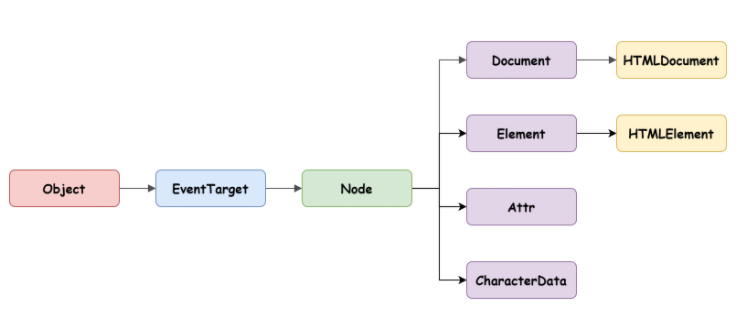

# 39장. DOM

## DOM이란?

- Dodument Object Model은 HTML문서의 계층적 구조와 정보 그리고 여러 메소드들로 이루어진 트리 자료구조
- 노드 객체들로 구성된 트리 자료구조를 DOM이라 부르며 DOM 트리라고도 한다.

## 노드

### HTML요소와 노드객체

- HTML 요소는 HTML 문서를 구성하는 개별적인 요소를 의미한다.
- HTML 요소는 렌더링 엔진에 의해 파싱되어 DOM을 구성하는 요소 노드 객체로 변환된다.
- HTML 요소는 시작 및 종료 태그, 어트리뷰트, 콘텐츠로 이루어진다.
- 서로 중첩관계를 갖고 이로인해 계층적인 부자관계가 형성된다.

## 노드의 종류

HTML 요소는 렌더링 엔진을 통해 DOM을 구성하는 `요소 노드`객체로 변환된다.이때 HTML 요소의 어트리뷰트는 `어트리뷰트 노드`로 텍스트 콘텐츠는 `텍스트 노드`로 변환된다.

## 노드 객체 타입

- 문서 노드

  - DOM 트리 최상위 노드이며 document 객체를 가리킨다.
  - window.document로 참조할 수 있으며 HTML문서당 하나의 유일한 객체이다.

- 요소 노드

  - HTML 요소를 가리키는 객체이다.
  - 중첩에 의해 계층적인 부자관계를 가지고, 문서의 구조를 표현한다.

- 어트리뷰트 노드

  - HTML 요소의 어트리뷰트를 가리키는 객체이며 어트리뷰트가 지정된 요소 노드와 연결되어있다.
  - 어트리뷰트를 참조하거나 변경하려면 요소 노드에 접근해야 한다.

- 텍스트 노드
  - HTML 요소의 텍스트를 가리키는 객체이다.
  - 문서의 정보를 표현한다.
  - 요소 노드의 자식이자 DOM 트리의 리프노드이다.

## 노드 객체의 상속 구조

노드 객체는 ECMAScript에 정의된 표준 빌트인 객체가 아니라 브라우저 환경에서 제공하는 호스트 객체이다. 하지만 노드 객체도 자바스크립트 객체이기 때문에 `Object`를 상속받는다.



모든 노드 객체는 `Object`, `EventTarget`, `Node`인터페이스를 상속받는다.

input과 같은 요소는 다음과 같은 구조로 되어있다.

Object -> EventTarget -> Node -> Element -> HTMLElement -> HTMLInputElement

# 요소 노드 취득 - DOM API

### id를 이용한 요소 노드 취득

- **Document.prototype.getElementById**

id는 HTML문서 내에서 유일한 값이여야 하지만 중복되는 id값이 있을 경우 첫 번째 요소만 반환한다.

### 태그를 이용한 요소 노드 취득

- **Document.prototype.getElementByTagName**
- **Element.prototype.getElementByTagName**

여러 개의 요소 노드 객체를 갖는 DOM 컬렉션 객체인 HTMLCollection 객체를 반환한다.  
이 객체는 유사 배열 객체이면서 이터러블이다.

위 둘의 차이는 DOM 전체에서 탐색하느냐 특정 요소 노드의 자식중에 탐색하느냐 차이다.

### class를 이용한 노드 취득

- **Document.prototype.getElementByClassName**
- **Element.prototype.getElementByClassName**

### CSS 선택자를 이용한 노드 취득

- **Document.prototype.querySelectorAll**
- **Element.prototype.querySelectorAll**

### 특정 요소를 취득할 수 있는지 확인

- **Element.prototype.matches**

css 선택자를 통해 특정 요소 노드를 취득할 수 있는지 확인

### HTMLCollection

- DOM API가 여러 개의 결과 값을 반환하기 위한 DOM 컬렉션 객체이다.
- 유사 배열 객체, 이터러블 이다.
- 노드 객체의 상태 변화를 실시간으로 반영하는 **살아있는 객체**이다.

```js
const $elem = document.getElementsByClassName('red');

console.log($elems); // HTMLCollection(3) [li.red, li.red, li.red]

// HTMLCollection 객체의 모든 요소의 class 값을 'blue'로 변경한다.
for (let i = 0; i < $elems.length; i++) {
  $elems[i].className = 'blue';
}

console.log($elmes); // HTMLCollection(1) [li.red]
```

모든 요소가 `blue`로 변할것 같지만 실시간으로 반영하기 때문에 첫 번째 반복때 elems[0]이 blue로 변경되면서 그 다음요소는 3번째 요소를 가리키기 때문이다.

해결 방법은 for문을 역으로 돌리기, while문으로 반복하기

### NodeList

HTMLCollection 객체의 부작용을 해결하기 위해 querySelectorAll 메소드를 사용하여 NodeList 객체를 반환하게 만든다.

- NodeList 객체는 실시간으로 노드 객체의 상태 변화를 반영하지 않는다.
- childNodes 프로퍼티가 반환하는 NodeList 객체는 HTMLCollection 객체와 같이 실시간으로 노드 객체의 상태 변경을 반영하는 live 객체로 동작하므로 주의가 필요하다.
- 안전하게 사용하려면 배열로 변환해서 사용하는 것을 권장한다.

# 노드 탐색

- Node.prototype은 parentNode, previousSibling, firstChild,childNodes 제공
- Element.prototype은 previousElementSibling, nextElementSibling, children 제공

노드 탐색 프로퍼티는 모두 접근자 프로퍼티며 setter없이 getter만 존재한다.

## 공백 텍스트 노드

HTML 요소 사이의 스페이스, 탭, 줄바꿈 등의 공백 문자는 텍스트 노드를 생성하는데 이를 공백 텍스트 노드라고 한다.

## 자식 노드 탐색

- Node.prototype.childNodes
- Node.prototype.firstChild
- Node.prototype.lastChild
- Element.prototype.children
- Element.prototype.firstElementChild
- Element.prototype.lastElementChild

NodeList는 요소 뿐만 아니라 텍스트 노드도 포함되어 있지만 Element는 텍스트 노드가 포함되지 않음.

## 부모 노드 탐색

- Node.prototype.parentNode

## 형제 노드 탐색

- Node.prototype.previousSibling
- Node.prototype.nextSibling
- Element.prototype.previousElementSibling
- Element.prototype.nextElementSibling
