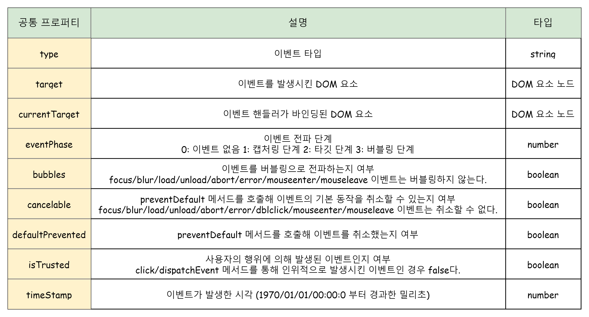

# 40장. 이벤트

## 1. 이벤트 드리븐 프로그래밍

브라우저는 처리해야 할 특정 사건이 발생하면 이를 감지하여 이벤트를 발생시킨다. 만약 애플리케이션이 특정 타입의 이벤트에 대해 반응하여 어떤 일을 하고싶다면 해당하는 타입의 이벤트가 발생했을 때 호출될 함수를 브라우저에게 알려 호출한다. 이 때 이벤트가 발생했을 때 호출될 함수를 **이벤트 핸들러** 라고 하고 호출을 위임하는 것을 **이벤트 핸들러 등록**이라고 한다. 이 때 언제 호출될 지 모르므로 브라우저에게 함수 호출을 위임한다.

```js
...
const $button = document.querySelector('button');
$button.onClick=()=>{
    console.log('btn click');
}

```
> 이처럼 프로그램의 흐름을 이벤트 중심으로 제어하는 프로그래밍 방식을 **이벤트 드리븐 프로그래밍**이라 한다.

## 2. 이벤트 타입

이벤트 타입은 이벤트의 종류를 나타내는 문자열이다.

- 마우스 이벤트: click,dbclick,mousedown,mouseup,mousemove ...등
- 키보드 이벤트: keydown,keypress,keyup ...등
- 포커스 이벤트: focus, focustin, focusout ..등

## 3. 이벤트 핸들러 등록

- 이벤트 핸들러는 이벤트 발생 시 브러우저에 의해 호출될 함수
- 이벤트 핸들러를 등록하는 방법은 3가지 이다.

### 3-1. 이벤트 핸들러 어트리뷰트 방식

- 이벤트 핸들러 어트리뷰트 방식은 on 접두사와 이벤트의 종류를 나타내는 이벤트 타입으로 이루어져있다.
- 이벤트 핸들러 어트리뷰트 값으로 함수 호출문 등의 문(statement)를 할당하면 이벤트 핸들러가 등록된다.

```html
<button onClick="sayHi('lee')"> click </button>
<script>
    function sayHi(name){
        console.log(`hi ${name}`);
    }
</script>
```

주의할 점은 이벤트 핸들러 어트리뷰트 값으로 함수 참조가 아닌 함수 호출문 등의 문을 할당한다는 것이다. 이벤트 핸들러를 등록할 때 콜백 함수와 마찬가지로 함수 참조를 등록해야 브라우저가 이벤트 핸들러를 호출할 수 있다. 함수가 아닌 값을 반환하는 함수 호출문을 이벤트 핸들러로 등록하면 브라우저가 이벤트 핸들러를 호출할 수 없다.   
이 때 **이벤트 핸들러 어트리뷰트 값은 사실 암묵적으로 생성될 이벤트 핸들러의 함수 몸체를 의미한다.** , onClick ="sayHi('lee')" 어트리뷰트는 파싱되어 다음과 같은 함수를 암묵적으로 생성한다.

```js
function onClick(event){
    sayHi('lee');
}
```

- 이벤트 핸들러 어트리뷰트 방식은 오래된 코드에서 사용된다. (더는 사용하지 않아도 좋다.)
- HTML과 자바스크립트는 관심사가 다르므로 혼재하는것 보다 분리하는것이 좋다.
- CBD 방식의 Angular/React/Vue/Svelte 같은 프레임워크는 이벤트 핸들러 어트리뷰트 방식으로 처리한다.

### 3-2. 이벤트 핸들러 프로퍼티 방식

- 이벤트 핸들러 프로퍼티 키는 이벤트 핸들러 어트리뷰트와 마찬가지로 onClick과 같이 on 접두사와 이벤트의 종류를 나타내는 이벤트 타입으로 이루어져 있다.   
- 이벤트 핸들러 프로퍼티에 함수를 바인딩하면 이벤트 핸들러가 등록된다.

```html
<button>click</button>
<script>
    const $button = ducument.querySelector('button');
    $button.onClick = function(){
        console.log('click button');
    }
</script>
```

- 이벤트 핸들러를 등록하기 위해서는 이벤트를 발생시킬 객체인 **이벤트 타겟** 과 이벤트의 종류를 나타내는 문자열인 **이벤트 타입** 그리고 **이벤트 핸들러**를 지정할 필요가 있다.
- 이벤트 핸들러 프로퍼티 방식은 html과 javascript를 뒤섞은 문제를 해결할 수 있다.
- 하지만 이벤트 하나의 이벤트만 바인딩 된다.

### 3-3. addEventListener 메서드 방식

- DOM Level2에서 도입돤 EventTarget.prototype.addEventListener 메서드를 사용하여 이벤트를 등록할 수 있다.

> EventTaget.addEventLister('이벤트타입,'이벤트 핸들러',캡처링 사용여부 : true: 캡처링, false :버블링(기본값)) 

```html
<button></button>
<script>
    const $button = document.querySelector('button');
    $button.addEventListener('click',function(){
        console.log('click');
    });
    </script>
```

- 만약 이벤트 핸들러 프로퍼티 방식으로 이벤트를 바인딩하더라도 addEventListener 메서드는 아무런 영향을 주지 않고 2개의 이벤트가 호출 된다.
- 동일한 html요소에 하나 이상의 이벤트를 등록할 수 있다. 이 때 핸들러 이벤트는 등록된 순으로 호출된다. (단 참조가 동일하면 하나만 등록된다.)

## 4. 이벤트 핸들러 제거 

- EventTarget.prototype.removeEventListener 메서드를 사용하여 이벤트를 제거한다.
- 단 addEventListener 메서드에 전달한 인수와 다르면 이벤트 핸들러가 제거되지 않는다.

```html
<button>click</button>
<script>
    const $button = document.querySelector('button');
    const handleClick =()=> console.log('button click');
    $button.addEventListener('click',handleClick);
    $button.removeEventListener('click',handleClick,true) //실패
    $button.removeEventListener('click',handleClick) 성공 

</script>
```
- 다음과 같이 무명함수로 등록한 이벤트 핸들러는 제거할 수 없다.

```js
$button.addEventListener('click',()=>console.log('hello'));
```


이벤트 핸들러 프로퍼티 방식으로 등록한 이벤트 핸들러는 `null`을 할당해서 제거할 수 있다.

## 5. 이벤트 객체

이벤트가 발생하면 이벤트에 관련된 다양한 정보를 담고 있는 이벤트 객체가 동적으로 생성된다. **생성된 이벤트 객체는 이벤트 핸들러의 첫 번째 인수로 전달된다.**

```html
<em class="message"></em>
<script>
    const $msg = document.querySelector('.message');

    //클릭 이벤트에 의해 생성된 이벤트 객체는 이벤트 핸들러의 첫 번째 인수로 전달된다.
    function showCoords(e){
        $msg.textContent = `client X: ${e.clientX}, client Y:${e.clientY}`;
    }
    document.onClick=showCoords;
</script>
```

### 5-1. 이벤트 객체의 상속 구조

- 이벤트가 발생하면 이벤트 타입에 따라 다양한 타입의 이벤트 객체가 생성된다.
- Event, UIEvent, MouseEvent 등 모두는 생성자 함수다. 따라서 다음과 같이 생성자를 호출하여 이벤트 객체를 생성할 수 있다.

```html
<!DOCTYPE html>
<html>
<body>
  <script>
    // Event 생성자 함수를 호출하여 foo 이벤트 타입의 Event 객체를 생성한다.
    let e = new Event('foo');
    console.log(e);
    // Event {isTrusted: false, type: "foo", target: null, ...}
    console.log(e.type); // "foo"
    console.log(e instanceof Event); // true
    console.log(e instanceof Object); // true

    // FocusEvent 생성자 함수를 호출하여 focus 이벤트 타입의 FocusEvent 객체를 생성한다.
    e = new FocusEvent('focus');
    console.log(e);
    // FocusEvent {isTrusted: false, relatedTarget: null, view: null, ...}

    // MouseEvent 생성자 함수를 호출하여 click 이벤트 타입의 MouseEvent 객체를 생성한다.
    e = new MouseEvent('click');
    console.log(e);
    // MouseEvent {isTrusted: false, screenX: 0, screenY: 0, clientX: 0, ... }

    // KeyboardEvent 생성자 함수를 호출하여 keyup 이벤트 타입의 KeyboardEvent 객체를
    // 생성한다.
    e = new KeyboardEvent('keyup');
    console.log(e);
    // KeyboardEvent {isTrusted: false, key: "", code: "", ctrlKey: false, ...}

    // InputEvent 생성자 함수를 호출하여 change 이벤트 타입의 InputEvent 객체를 생성한다.
    e = new InputEvent('change');
    console.log(e);
    // InputEvent {isTrusted: false, data: null, inputType: "", ...}
  </script>
</body>
</html>
```

## 5-2. 이벤트 객체의 공통 프로퍼티

;

`Event` 하위 인터페이스에는 이벤트 타입에 따라 고유한 프로퍼티가 정의되어 있다.   
`MouseEvent` 타입의 이벤트 객체는 screenX/screenY, clientX/clientY, pageX/pageY, offsetX/offsetY 등의 프로퍼티를 갖고있다.

## 6. 이벤트 전파

DOM 트리 상에 존재하는 DOM 요소 노드에서 발생한 이벤트는 DOM 트리를 통해 전파된다. 이를 이벤트 전파라고 한다.


```html
<ul id ="fruits">
    <li id="apple">apple</li>
    <li id="banana">banana</li>
    <li id="orange">orange</li>
</ul>
```
`ul`의 두 번째 자식인 `li`를 클릭하면 클릭 이벤트가 발생한다. 이때 **생성된 이벤트 객체는 이벤트를 발생시킨 DOM 요소인 이벤트 타켓을 중심으로 DOM 트리를 통해 전파된다.**   
이벤트 객체가 전파되는 방향에 따라 3가지로 구분할 수 있다.

1. **캡처링 단계**: 이벤트가 상위 요소에서 하위 요소 방향으로 전파.
2. **타깃 단계**: 이벤트가 이벤트 타깃에 도달
3. **버블링 단계**: 이벤트가 하위 요소에서 상위 요소 방향으로 전파

이벤트 핸들러 어트리뷰트 및 프로퍼티 방식으로 등록한 이벤트 핸들러는 타겟 단계와 버블링 단계의 이벤트만 캐치할 수 있지만, `addEventListener`로 등록한 이벤트 핸들러는 캡쳐링 단계까지 캐치할 수 있다.

대부분의 이벤트는 캡처링과 버블링을 통해 전파된다. 하지만 다음 이벤트는 버블링을 통해 전파되지 않는다. `event.bubbles`의 값이 모두 `false`

- 포커스 이벤트: focus/blur
- 리소스 이벤트: load/unload/abort/error
- 마우스 이벤트: mouseenter/mouseleave

위 이벤트는 버블링되지 않으므로 이벤트 타겟의 상위 요소에서 위 이벤트를 캐치하려면 캡처링 단계의 이벤트를 캐치해야 한다. 만약 상위 요소에서 캐치하고 싶다면, 포커스 이벤트는 focusin/focustout, 마우스 이벤트는 mouseover/mouseout으로 대채할 수 있다.   

```html
<!DOCTYPE html>
<html>
<body>
  <p>버블링과 캡처링 이벤트 <button>버튼</button></p>
  <script>
    // 버블링 단계의 이벤트 캐치
    document.body.addEventListener('click', () => {
    	console.log('Handler for body.');
    });
    
    // 캡처링 단계의 이벤트 캐치
    document.querySelector('p').addEventListener('click', () => {
    	console.log('Handler for paragraph.');
    }, true);
    
    // 버블링 단계의 이벤트 캐치
    document.querySelector('button').addEventListener('click', () => {
    	console.log('Handler for button.');
    });
  </script>
</body>
</html>
```

`body`와 `button`은 버블링 단계의 이벤트만을 캐치하고 `p`는 캡처링 단계의 이벤트만 캐치한다.
이벤트는 **캡처링 - 타겟 - 버블링** 순으로 진행되므로 출력은 아래와 같다. 

```
Handler for paragraph.
Handler for button.
Handler for body.
```

## 7. 이벤트 위임

이벤트 위임은 여러 개의 하위 DOM 요소에 각각 이벤트 핸들러를 등록하는 대신 하나의 상위 DOM 요소에 이벤트 핸들러를 등록하는 것을 말한다. 이벤트 위임을 통해 상위 DOM 요소에 이벤트 핸들러를 등록하면 여러 개의 하위 DOM 요소에 이벤트 핸들러를 등록할 필요가 없다.

```html
<!DOCTYPE html>
<html>
<body>
  <ul class="post-list">
    <li id="post-1">Item 1</li>
    <li id="post-2">Item 2</li>
    <li id="post-3">Item 3</li>
    <li id="post-4">Item 4</li>
  </ul>
  <div class="msg" />
  <script>
    const msg = document.querySelector('.msg');
    const list = document.querySelector('.post-list')

    list.addEventListener('click', function (e) {
      console.log(e.target.id);
    });
  </script>
</body>
</html>
```

모든 `li`요소에 클릭이벤트를 줄 필요 없이 부모인 `ul`태그에 이벤트 핸들러를 바인딩 하면 이벤트 위임을 통해 자식에게도 바인딩 된다 (버블링)

## 8. DOM 요소의 기본 동작 중단

- Event.preventDefault()

DOM 요소는 저마다 기본 동작이 있어 `a`요소를 클릭하면 href로 지정된 링크로 이동하고 checkbox 요소를 클릭하면 체크되거나 해제된다.

```html
<!DOCTYPE html>
<html>
<body>
  <a href="http://www.google.com">go</a>
  <script>
  document.querySelector('a').onclick = e => {
    // a 요소의 기본 동작을 중단한다.
    e.preventDefault();
  };
  </script>
</body>
</html
```

- Event.stopPropagation()

이벤트 객체의 `stopPropagation` 메서드는 이벤트 전파를 중지시킨다.

```html
<!DOCTYPE html>
<html>
<body>
  <div class="container">
    <button class="btn1">Button 1</button>
    <button class="btn2">Button 2</button>
    <button class="btn3">Button 3</button>
  </div>
  <script>
    // 이벤트 위임. 클릭된 하위 버튼 요소의 color를 변경
    document.querySelector('.container').onclick = ({ target }) => {
      if(!target.matches('.container > button')) return;
      target.style.color = 'red';
    };
    
    document.querySelector('.btn2').onclick = e => {
      e.stopPropagation(); // 이벤트 전파 중단
      e.target.style.color = 'blue';
    };
  </script>
</body>
</html>
```

상위 DOM 요소인 container에 이벤트를 위임했다. 따라서 하위 DOM 요소에서 발생한 클릭 이벤트를 상위 DOM 요소인 container가 캐치해 이벤트를 처리한다.

하지만 하위 요소 중 btn2는 자체적으로 이벤트를 처리한다. btn2는 자신이 발생시킨 이벤트가 전파되는 것을 중단해 자신에게 바인딩된 이벤트 핸들러만 실행되도록 한다.

이렇게 stopPropagation 메서드는 하위 DOM 요소의 이벤트를 개별적으로 처리하기 위해 이벤트의 전파를 중단시킨다.

## 9. 이벤트 핸들러 내부의 this

### 9-1. 이벤트 핸들러 어트리뷰트 방식

이벤트 핸들러 어트리뷰트의 값으로 지정한 문자열은 사실 암묵적으로 생성되는 이벤트 핸들러의 문이라고 했다. 따라서 이벤트 핸들러에 의해 일반 함수로 호출된다. 일반함수에서 this는 `전역 객체`를 가리킨다.

### 9-2. 이벤트 핸들로 프로퍼티 방식과 addEventListener 방식

- 이벤트 핸들러 내부의 this는 이벤트를 바인딩한 DOM 요소를 가리킨다.
- 이벤트 핸들러 내부의 this는 이벤트 객체의 currentTarget 프로퍼티와 같다.

```html
<!DOCTYPE html>
<html>
<body>
  <button class="btn1">0</button>
  <button class="btn2">0</button>
  <script>
    const $button1 = document.querySelector('.btn1');
    const $button2 = document.querySelector('.btn2');

    // 이벤트 핸들러 프로퍼티 방식
    $button1.onclick = function (e) {
      // this는 이벤트를 바인딩한 DOM 요소를 가리킨다.
      console.log(this); // $button1
      console.log(e.currentTarget); // $button1
      console.log(this === e.currentTarget); // true

      // $button1의 textContent를 1 증가시킨다.
      ++this.textContent;
    };

    // addEventListener 메서드 방식
    $button2.addEventListener('click', function (e) {
      // this는 이벤트를 바인딩한 DOM 요소를 가리킨다.
      console.log(this); // $button2
      console.log(e.currentTarget); // $button2
      console.log(this === e.currentTarget); // true

      // $button2의 textContent를 1 증가시킨다.
      ++this.textContent;
    });
  </script>
</body>
</html>
```

- 화살표 함수로 정의한 이벤트 핸들러 내부의 this는 상위 스코프의 this를 가리킨다.

```html
<!DOCTYPE html>
<html>
<body>
  <button class="btn1">0</button>
  <button class="btn2">0</button>
  <script>
    const $button1 = document.querySelector('.btn1');
    const $button2 = document.querySelector('.btn2');

    // 이벤트 핸들러 프로퍼티 방식
    $button1.onclick = e => {
      // 화살표 함수 내부의 this는 상위 스코프의 this를 가리킨다.
      console.log(this); // window
      console.log(e.currentTarget); // $button1
      console.log(this === e.currentTarget); // false

      // this는 window를 가리키므로 window.textContent에 NaN(undefined + 1)을 할당한다.
      ++this.textContent;
    };

    // addEventListener 메서드 방식
    $button2.addEventListener('click', e => {
      // 화살표 함수 내부의 this는 상위 스코프의 this를 가리킨다.
      console.log(this); // window
      console.log(e.currentTarget); // $button2
      console.log(this === e.currentTarget); // false

      // this는 window를 가리키므로 window.textContent에 NaN(undefined + 1)을 할당한다.
      ++this.textContent;
    });
  </script>
</body>
</html>
```

## 10. 이벤트 핸들러에 인수 전달

- 함수에 인수를 전달하려면 함수를 호출할 때 전달해야 한다.
- 이벤트 핸들러 내부에서 함수를 호출하면 인수를 전달할 수 있다.

```html
<!DOCTYPE html>
<html>
<body>
  <label>User name <input type='text'></label>
  <em class="message"></em>
  <script>
    const MIN_USER_NAME_LENGTH = 5; // 이름 최소 길이
    const $input = document.querySelector('input[type=text]');
    const $msg = document.querySelector('.message');

    const checkUserNameLength = min => {
      $msg.textContent
        = $input.value.length < min ? `이름은 ${min}자 이상 입력해 주세요` : '';
    };

    // 이벤트 핸들러 내부에서 함수를 호출하면서 인수를 전달한다.
    $input.onblur = () => {
      checkUserNameLength(MIN_USER_NAME_LENGTH);
    };
  </script>
</body>
</html>
```
