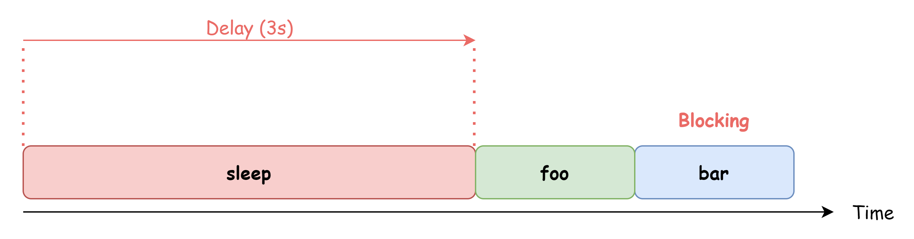
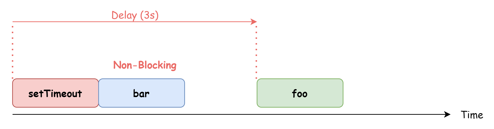
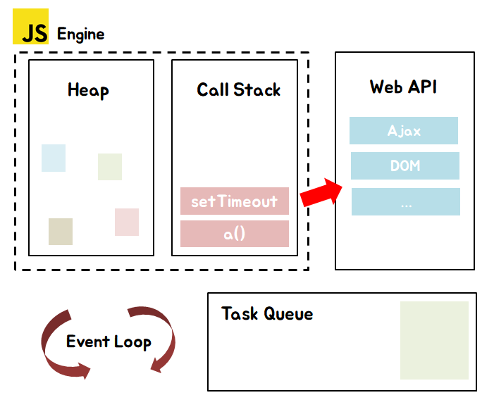

# 42장. 비동기 프로그래밍

## 42.1 동기 처리와 비동기 처리

함수를 호출하면 함수 코드가 평가되어 함수 실행 컨텍스트가 생성된다. 이때 생성된 함수 실행컨텍스트는 실행 컨텍스트 스택에 푸쉬되고 함수 코드가 실행된다.

함수가 호출된 순서대로 순차적으로 실행되는 이유는 함수가 호출된 순서대로 함수 실행 컨텍스트가 실행 컨텍스트 스택에 푸쉬되기 때문이다. 이처럼 함수의 실행 순서는 실행 컨텍스트 스택으로 관리된다.

**자바스크립트 엔진은 단 하나의 실행 컨텍스트 스택을 갖는다.** 이는 함수를 실행할 수 있는 창구가 단 하나 밖에 없다.

자바스크립트는 **싱글 스레드** 방식으로 동작한다. 싱글 스레드 방식은 한번에 하나의 태스크만 실행할 수 있기 때문에 처리에 시간이 걸리는 태스크를 실행하는 경우 **블로킹**이 발생한다.

### 동기 처리

```js
// 일정 시간이 경과한 이후에 콜백 함수를 호출
function sleep(func, delay) {
  const delayUntil = Date.now() + delay
  while (Date.now() < delayUntil);
  func()
}

function foo() {
  console.log('foo')
}

function bar() {
  console.log('bar')
}

sleep(foo, 3000)

bar()
```



위 예제의 sleep 함수는 3초후해 foo 함수를 호출한다. 이 때 bar 함수는 아직 sleep 함수가 끝나지 않아 호출되지 못하고 블로킹 된다.

### 비동기 처리

```js
function foo() {
  console.log('foo')
}

function bar() {
  console.log('bar')
}

setTimeout(foo, 3000)

bar()
//bar 호출 3초뒤  foo 호출
```

setTimeout 함수는 sleep함수와 유사하게 3초뒤에 foo를 실행하지만 함수 이후의 태스크를 블로킹 하지않고 곧바로 실행한다.



이처럼 현재 실행중인 태스크가 종료되지 않은 상태라 해도 다음 태스크를 곧바로 실행시키는 방식을 **비동기 처리** 라고 한다.

## 42.2 이벤트 루프와 태스크 큐

자바스크립트는 싱글 스레드로 동작하지만 브라우저가 동작하는 것을 살펴보면 태스크가 동시에 처리되는 것 처럼 느껴진다.

예를들어 HTML요소가 애니메이션 효과를 주면서 http 요청을 통해 서버로부터 데이터를 가지고 오기도 하고 렌더링 하기도 한다. 이처럼 자바스크립트의 **동시성**을 지원하는 것이 바로 **이벤트 루프**이다.



구글의 v8 자바스크립트 엔진을 비롯한 대부분의 자바스크립트 엔진은 크게 2개의 영역으로 구분할 수 있다.

### 콜스택과 힙

- 콜스택 : 소스코드가 평가되는 과정에서 생성된 실행컨텍스트를 추가 및 제거하는 자료구조
- 힙: 객체가 저장되는 메모리 공간.

이처럼 콜스택과 힙으로 구성되있는 자바스크립트 엔진은 태스크가 요청되면 요청된 작업을 순차적으로 실행할 뿐이다.

**비동기 처리에서의 소스코드 평가와 실행을 제외한 모든 처리는 브라우저 또는 Node.js에서 담당한다**

- 태스크 큐: setTimeout이나 setInterval과 같은 비동기 함수의 콜백을 보관하는 영역

- 이벤트 루프: 콜 스택에 현재 실행중인 컨텍스트가 있는지 태스크 큐에 대기중인 함수가 있는지 검사.

**자바스크립트는 싱글스레드로 동작하지만 브라우저는 멀티스레드로 동작한다.**
