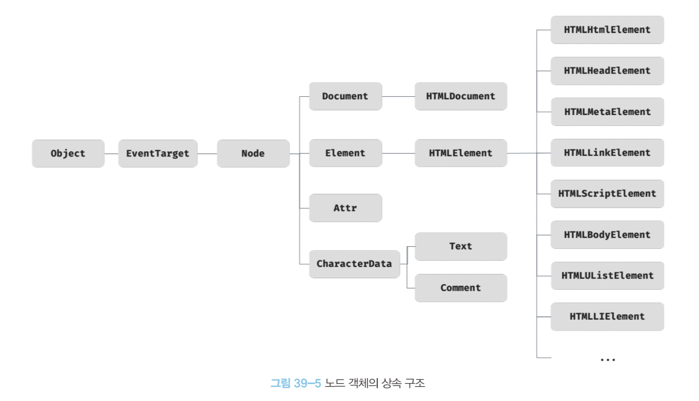

# 39장 DOM

**DOM(document object model)은 HTML 문서의 계층적 구조와 정보를 포함하며 이를 제어할 수 있는 프로퍼티와 메서드를 제공하는 트리 자료구조다.**

<br>

## 노드

### HTML 요소와 노드 객체

HTML 요소는 HTML 문서를 구성하는 개별적인 요소를 의미한다.

- HTML 요소는 렌더링 엔진에 의해 파싱되어 DOM을 구성하는 요소 노드 객체로 변환된다.
- 어트리뷰트는 어트리뷰트 노드로, 텍스트 콘텐츠는 텍스트 노드로 변환된다.
- 요소의 중첩 관계는 트리 자료구조에서 부모-자식 관계의 계층적인 노드로 구성된다.

DOM이란 노드 객체들로 구성된 트리자료 구조이다.

### 노드 객체의 타입

노드 객체의 종류는 총 12가지이다. 중요한 4가지 노드 타입에 대한 설명은 다음과 같다.

|    노드 종류    | 설명                                                                                                                                                                                                                                                                                                    |
| :-------------: | ------------------------------------------------------------------------------------------------------------------------------------------------------------------------------------------------------------------------------------------------------------------------------------------------------- |
|    문서 노드    | - DOM 트리의 최상위 노드이며 document 객체를 가리킨다.<br />- document 객체는 브라우저가 렌더링한 HTML 문서 전체를 가리키는 객체이다.<br />- window의 document 프로퍼티에 바인딩되어 있다.<br />- document 객체는 DOM 트리의 루트 노드이며 다른 노드들은 문서 노드를 통해서 다른 노드에 접근할 수 있다. |
|    요소 노드    | - HTML 요소를 가리키는 객체다.<br />- 부모 노드와 연걸되어 있으며 문서의 구조를 표현한다.                                                                                                                                                                                                               |
| 어트리뷰트 노드 | - HTML 요소의 어트리뷰트를 가리키는 객체다.<br />- 요소 노드의 형제 노드는 아니지만 요소 노드에만 연결되어 있다.<br />- 어트리뷰트 노드에 접근하려면 요소 노드에 접근해야 한다.                                                                                                                         |
|   텍스트 노드   | - HTML 요소의 텍스트를 가리키는 객체다.<br />- 문서의 정보를 표현한다.<br />- 요소 노드의 자식이자 DOM 트리의 리프 노드이다.<br />- 텍스트 노드에 접근하려면 요소 노드에 접근해야 한다.                                                                                                                 |

### 노드 객체의 상속 구조

DOM을 구성하는 노드 객체는 표준 빌트인 객체가 아닌 브라우저 환경에서 추가적으로 제공하는 호스트 객체이다.

노드 객체는 공통된 기능일수록 프로토타입 체인 상위에, 개별적인 고유 기능일수록 하위에 프로토타입 체인을 구축하여 프로퍼티와 메서드를 제공하는 상속 구조를 갖는다.

노드 객체의 상속 구조는 다음과 같다.



<br>

## 요소 노드 취득

요소 노드는 HTML 요소를 조작하는 시작점이며 HTML 구조나 스타일을 동적으로 조작하려면 요소 노드를 취득해야 한다.

### id를 이용한 요소 노드 취득

- HTML 요소에 id 어트리뷰트를 부여하면 id 값과 동일한 이름의 전역 변수가 암묵적으로 선언되고 해당 노드 객체가 할당된다.
- Document.prototype.getElementById

### 태그 이름을 이용한 노드 취득

- 여러 개의 요소 노드 객체를 갖는 DOM 컬렉션 객체인 HTMLCollection 객체를 반환한다.
- Document.prototype.getElementsByTagName
- Element.prototype.getElementsByTagName

### class를 이용한 노드 취득

- Document.prototype.getElementByClassName
- Element.prototype.getElementByClassName

### CSS 선택자를 이용한 요소 노득 취득

- querySelectorAll은 DOM 컬렉션 객체인 NodeList 객체를 반환한다.
- Document.prototype.querySelector | querySelectorAll
- Element.prototype.querySelector | querySelectorAll

### 특정 요소를 취득할 수 있는지 확인

- CSS 선택자를 통해 특정 요소 노드를 취득할 수 있는지 확인한다.
- Element.prototype.matches

### HTMLCollection

HTMLCollection은 DOM 컬렉션 객체이며 유사 배열 객체, 이터러블이다.

- 노드 객체의 상태 변화를 실시간으로 반영하는 살아있는 객체다.
- for 문으로 순회하면서 노드 객체를 변경하면 부작용을 발생시킬 수 있다.
- 안전하게 사용하기 위해서는 HTMLCollection 객체를 배열로 변환해 사용해야 한다.

### NodeList

HTMLCollection 객체의 부작용을 해결하기 위해 querySelectorAll 메서드를 사용할 수 있다. 이 메서드는 NodeList 객체를 반환한다.

- NodeList 객체는 실시간으로 노드 객체의 상태 변화를 반영하지 않는다.
- NodeList.protytpe은 forEach, item, entries, keys, values 메서드를 제공한다.
- childNodes 프로퍼티가 반환하는 NodeList 객체는 실시간으로 노드 객체 상태 변경을 반영하는 살아있는 개체이다.
- 안전하게 사용하기 위해서는 NodeList 객체를 배열로 변환해 사용해야 한다.

<br>

## 노드 탐색

노트 탐색 프로퍼티 DOM 트리상의 노드를 탐색할 수 있는 프로퍼티이며 는 setter없이 getter만 존재하여 참조만 가능한 읽기 전용 접근자 프로퍼티이다.

- Node.prototype: parentNode, previousSibling, firstChild, childNodes
- Element.protytpe: previousElementSibling, nextElementSibling, children

### 공백 텍스트 노드

HTML 요소 사이의 스페이스, 탭, 줄바꿈 등의 공백 문자는 텍스트 노드를 생성한다.

- 텍스트 에디터에서 스페이스 키, 탭 키, 엔터 키 등을 입력하면 추가된다.
- 공백 문자는 HTML 파싱 후 생성되는 DOM의 노드이다.
- 노드를 탐색할 때 공백 텍스트 노드에 주의해야 한다.

### 자식 노드 탐색

- Node.prototype.childNodes
- Element.prototype.children: 텍스트 노드는 포함되지 않는다.
- Node.prototype.firstChild
- Node.prototype.lastChild
- Element.prototype.firstElementChild
- Element.prototype.lastElementChild
- Node.prototype.hasChildNodes: 자식 노드가 존재하면 true, 존재하지 않으면 false를 반환한다. 텍스트 노드를 포함한다.
- Node.prototype.length: 텍스트 노드가 아닌 요소 노드가 자식 노드에 포함되는지 확인할 수 있다.

### 부모 노드 탐색

- Node.prototype.parentNode

### 형제 노드 탐색

- Node.prototype.previousSibling
- Node.prototype.nextSibling
- Element.prototype.previousElementSibling
- Element.prototype.nextElementSibling

<br>

## 노드 정보 취득

다음과 같은 프로퍼티로 노드 객체에 대한 정보를 취득할 수 있다.

- Node.prototype.nodeType: 노드 타입을 나타내는 상수를 반환한다.
  - Node.ELEMENT_NODE: 1, 요소 노드 타입
  - Node.TEXT_NODE: 3, 텍스트 노드 타입
  - Node.DOCUMENT_NODE: 9, 문서 노드 타입
- Node.prototype.nodeName: 노드의 이름을 문자열로 반환한다.

<br>

## 요소 노드의 텍스트 조작

아래 프로퍼티들은 노드 탐색, 노드 정보 프로퍼티와 다르게 setter와 getter 모두 존재하는 접근자 프로퍼티다.

### nodeValue

- Node.prototype.nodeValue
- 노드 객체의 값, 즉 텍스트 노드의 텍스트를 반환한다.
- 문서 노드나 요소 노드를 참조하면 null을 반환한다.
- nodeValue에 값을 할당하면 텍스트 노드의 값, 즉 텍스트를 변경할 수 있다.
- 텍스트 변경할 요소 노드를 취득하고 요소 노드의 firstChild 프로퍼티를 사용해 텍스트 노드를 탐색한 다음 값을 변경해야 한다.

### textContent

- Node.protytpe.textContent
- 요소 노드의 텍스트와 모든 자손 노드의 텍스트를 모두 취득하거나 변경한다.
- 요소 노드의 childNodes 프로퍼티가 반환한 모든 노드들의 텍스트 노드의 값을 반환한다.
- HTML 마크업은 무시된다. 즉, 요소 노드의 모든 텍스트들을 취득한다.
- textContent 프로퍼티에 문자열을 할당하면 요소 노드의 모든 자식 노드가 제거되고 할당한 문자열이 텍스트로 추가된다. 문자열이기 때문에 HTML 파싱은 무시된다.

**textContent와 유사한 동작을 하는 innerText 프로퍼티는 `human-readable` 요소만 취득한다. 쉽게 말해 CSS에 의해 표시되지 않도록 지정된 요소 노드의 텍스트를 반환하지 않는다. 또한 textContent 요소보다 느리므로 사용하지 않는 것이 좋다.**

<br>

## DOM 조작

DOM 조작에 의해 DOM에 새로운 노드가 추가되거나 삭제되면 리플로우와 리페인트가 발생해 성능에 영향을 준다.

다음은 DOM 조작을 할 수 있는 프로퍼티에 대한 설명이다.

### innerHTML

- Element.prototype.innerHTML
- setter와 getter 모두 존재하는 접근자 프로퍼티다.
- 참조하면 요소 노드의 콘텐츠 영역내에 포함된 모든 HTML 마크업을 문자열로 반환한다.
- **문자열을 할당하면 요소 노드의 모든 자식 노드가 제거되고 HTML 마크업이 파싱되어 요소 노드의 자식 노드로 DOM에 반영된다.**
- **렌더링 엔진에 의해 파싱되어 DOM에 반영될 때 크로스 사이트 스크립팅 공격에 취약하다. HTML 마크업 내 자바스크립트 악성 코드가 포함되어 있다면 그대로 실행될 가능성이 있기 때문이다.**
- HTML5는 innerHTML로 삽입된 script 요소 내의 자바스크립트 코드를 실행하지 않는다.
- DOMPurify 라이브러리의 sanitize를 통해 위험을 제거할 수 있다.
- **새로운 요소를 삽입할 때 삽입될 위치를 지정할 수 없다.**

### insertAdjacentHTML 메서드

- 기존 요소를 제거하지 않으면서 위치를 지정해 새로운 요소를 삽입할 수 있는 메서드이다.
- 두 번째 인수로 전달한 HTML 마크업 문자열을 파싱하고 첫 번째 인수로 입력한 위치에 삽입해 DOM에 반영한다.
- 기존 요소에 영향을 주지않고 새롭게 삽입될 요소만 파싱해 추가하므로 innerHTML보다 효율적이고 빠르다.
- HTML 마크업 문자열을 파싱하기 때문에 크로스 사이트 스크립트 공격에는 취약하다.

### 노드 생성과 추가

DOM은 노드를 직접 생성/삽입/삭제/치환하는 메서드를 제공한다.

요소 노드와 텍스트 노드를 생성해 DOM에 추가하는 과정은 다음과 같다.

**1. 요소 노드 생성**

```js
const $li = document.createElement('li');
console.log($li.childNodes); // NodeList []
```

- Document.prototype.createElement('tagname') 메서드는 요소 노드를 생성해 반환한다.
- 생성한 요소 노드는 DOM에 추가되지 않고 홀로 존재한다.
- 생성한 요소 노드는 아무런 자식 노드를 가지고 있지 않다. 즉 텍스트 노드가 없는 상태다.

**2. 텍스트 노드 생성**

```js
const textNode = document.createTextNode('Banana');
```

- Document.prototype.createTextNode('text') 메서드는 텍스트 노드를 생성해 반환한다.
- 생성한 텍스트 노드는 요소 노드의 자식 노드가 아닌 홀로 존재하는 상태다.
- 생성한 텍스트 노드를 요소 노드에 추가하는 처리가 필요하다.

**3. 텍스트 노드를 요소 노드의 자식 노드로 추가**

```js
$li.appendChild(textNode);
```

- Node.prototype.appenChild(childNode) 메서드는 매개변수 childNode에게 인수로 전달한 노드를 appendChild 메서드를 호출한 노드의 마지막 자식 노드로 추가한다.
- 요소 노드와 텍스트 노드가 부자 관계로 연결되었지만 DOM에는 추가되지 않은 상태이다.
- 요소 노드에 자식 노드가 하나도 없을 때는 별도의 텍스트 노드를 생성하는 것이 아닌 textContent 프로퍼티를 사용하는 것이 더욱 간편하다.

**4. 요소 노드를 DOM에 추가 **

```js
$fruits.appendChild($li);
```

- 부자 관계로 연결한 요소 노드를 기존 요소 노드의 마지막 자식으로 추가한다.
- 이 과정에서 새로운 요소 노드가 DOM에 추가되므로 DOM은 한 번 변경되고 리플로우와 리페인트가 실행된다.

### 복수의 노드 생성과 추가

```js
// ...

const $fruits = document.getElementById('fruits');

['Apple', 'Banana', 'Orange'].forEach((text) => {
  // 1. 요소 노드 생성
  const $li = document.createElement('li');
  // 2. 텍스트 노드 생성
  const textNode = document.createTextNode(text);
  // 3. 텍스트 노드를 요소 노드의 자식으로 추가
  $li.appendChild(textNode);
  //4. 요소 노드를 DOM에 추가
  $fruits.appendChild($li);
});

// ...
```

위 예제를 실행하면 3개의 요소 노드를 생성해 DOM으로 추가하기 때문에 DOM이 3번 변경되며 따라서 리플로우와 리페인트도 3번 실행된다. 이는 비효율적이며 성능에 영향을 준다.

이를 방지하기 위해 컨테이너 요소와 DcoumentFrage 노드를 사용해 DOM을 한 번만 변경해 보자.

```js
// ...

const $li = document.createElement('li');

// 컨테이너 요소 노드 생성
const $fragment = document.createDocumentFragment();
// const $container = document.createElement('div');
// div 요소를 컨테이너로 사용하면 불필요한 요소가 추가되는 부작용이 있다.

['Apple', 'Banana', 'Orange'].forEach((text) => {
  // 1. 요소 노드 생성
  const $li = document.createElement('li');
  // 2. 텍스트 노드 생성
  const textNode = document.createTextNode(text);
  // 3. 텍스트 노드를 요소 노드의 자식으로 추가
  $li.appendChild(textNode);
  //4. 요소 노드를 DOM에 추가
  $fragment.appendChild($li);
  // container.appendChild($li);
});

$fruits.appendChild($container);
// ...
```

DocumentFragement 노드는 자식 노드들의 부모 노드로서 별도의 서브 DOM을 구성한 다음 기존 DOM에 추가하는 용도로 사용된다. 실제 DOM 변경은 한 번만 발생하므로 리플로우와 리페인트도 한 번만 실행된다.

### 노드 삽입

- Node.prototype.appendChild: 인수로 전달받은 노드를 자신을 호출한 노드의 마지막 자식 노드로 DOM에 추가한다.
- Node.prototype.inserBefore(newNode, childNode): 첫 번째 인수로 전달받은 노드를 두 번쨰 인수로 전달받은 노드 앞에 삽입한다. 두 번째 인수 노드는 반드시 호출 노드의 자식 노드여야 한다.

### 노드 이동

DOM에 이미 존재하는 노드를 appendChild 또는 insertBefore 메서드를 사용해 DOM에 추가하면 현재 위치에서 노드를 제거하고 새로운 위치에 노드를 추가한다.

### 노드 복사

- Node.prototype.cloneNode(deep)
- 노드의 사본을 생성해 반환한다.
- 매개변수 deep을 true로 전달하면 깊은 복사로 자손 노드가 포함된 사본을 생성한다.
- deep을 false로 전달하면 얕은 복사로 자식 노드를 포함하지 않아 텍스트 노드가 없는 사본을 생성한다.

### 노드 교체

- Node.prototype.replaceChild(newChild, oldChild)
- 자신을 호출 노드의 자식 노드를 다른 노드로 교체한다.
- oldChild 매개변수로 전달한 노드는 호출 노드의 자식 노드여야 한다.
- oldChild를 newChild 노드로 교체하고 oldChild 노드는 DOM에서 제거된다.

### 노드 삭제

- Node.protytpe.removeChild(child)
- child 매개변수로 전달한 노드를 DOM에서 삭제한다.

<br>

## 어트리뷰트

### 어트리뷰트 노드와 attributes 프로퍼티

HTML 문서가 파싱될 때 HTML 요소의 어트리뷰트는 어트리뷰트 노드로 변환되어 요소 노드와 연결된다. 이 때 HTML 어트리뷰트당 하나의 어트리뷰트 노드가 생성된다.

```html
<input id="user" type="text" value="v" />
```

예를 들어 위 input 요소는 3개의 어트리뷰트가 있으므로 3개의 어트리뷰트 노드가 생성된다. 어트리뷰트 노드는 NamedNodeMap 객체에 담겨서 요소 노드의 attributes 프로퍼티에 저장된다.

어트리뷰트 노드는 Element.prototype.attributes 프로퍼티로 취득할 수 있다. 이 프로퍼티는 읽기 전용이며 NamedNodeMap 객체를 반환한다.

```js
const { attributes } = document.getElementById('user');
console.log(attirubtes.id.value, attirubtes.type.value, attirubtes.value.value);
// user, text, v
```

### HTML 어트리뷰트 조작

Element.prototype.getAttribute/setAttritube 메서드를 사용하면 attributes 프로퍼티를 통하지 않고 요소 노드에서 직접 어트리뷰트 값을 취득하거나 변경할 수 있다.

```js
const $input = doucmnet.getElementById('user');
console.log($input.getAttribute('value')); // v

$input.setAttribute('value', 'new');
console.log($input.getAttribute('value')); // new
```

특정 HTML 어트리뷰트가 있는지 확인하려면 Element.prototype.hasAttribute(attrbuteName) 메서드를 사용하고 어트리뷰트를 삭제하려면 Element.prototype.removeAttribute(attributeName) 메서드를 사용한다.

### HTML 어트리뷰트 vs DOM 프로퍼티

요소 노드 객체에는 HTML 어트리뷰트에 대응하는 DOM 프로퍼티가 존재한다. 요소 노드는 초기 상태와 사용자의 입력에 따라 변화하는 최신 상태를 관리해야 한다.

- HTML 어트리뷰트의 역할은 HTML 요소의 초기 상태를 지정하는 것이다. 값은 변하지 않는다.
- DOM 프로퍼티는 getter와 setter 모두 존재하며 요소 노드의 최신 상태를 관리하며 항상 최신 상태를 유지한다.

대부분의 HTML 어트리뷰트는 HTML 어트리뷰트 이름과 동일한 DOM 프로퍼티와 1:1로 대응한다. 그러나 다음과 같은 어트리뷰트에는 예외적이다.

- input의 value 어트리뷰트의 초기 상태는 value 어트리뷰트에, 최신 상태는 value 프로퍼티에 대응한다.
- class 어트리뷰트는 className, classList 어트리뷰트와 대응한다.
- for 어트리뷰트는 htmlFor 프로퍼티에 대응한다.
- textContent 프로퍼티는 대응하는 어트리뷰트가 존재하지 않는다.
- 어트리뷰트에 대응하는 프로퍼티 키는 카멜 케이스를 따른다.

getAttribute 메서드로 취득한 어트리뷰트 값은 언제나 문자열이다. 그러나 DOM 프로퍼티로 취득한 최신 상태 값은 문자열이 아닐 수 있다. checkbox 요소의 checked 어트리뷰트 값은 문자열 이지만 checked 프로퍼티 값은 불리언이다.

### data 어트리뷰트와 dataset 프로퍼티

data 어트리뷰트와 dataset 프로퍼티를 사용하면 HTML 요소에 정의한 사용자 정의 어트리뷰트와 자바스크립트간의 데이터를 교환할 수 있다.

data 어트리뷰트에 data- 접두사 다음에 data 프로퍼티에 값을 할당하면 HTML 요소에 data 어트리뷰트가 추가된다.

```html
<!-- ... -->
<ul class="users">
  <li id="1" data-user-id="1234">user 1</li>
  <li id="2" data-user-id="0909">user 2</li>
</ul>
<script>
  const users = [...document.querySelector('.users').children];

  users.forEach((user) => {
    consloe.log(user.dataset);
  });
  /*
	DOMStringMap {userId: '1234'}
		<li id="1" data-user-id='1234'>user 1</li>
    
    ...
	*/
</script>
```

<br>

## 스타일

### 인라인 스타일 조작

- HTMLElement.prototype.style
- 요소 노드의 인라인 스타일을 취득하거나 변경하는 프로퍼티다.
- 참조하면 CSSStyleDeclaration 타입의 객체를 반환한다. CSS 프로퍼티에 대응하는 프로퍼티를 가지고 있다.
- CSS 프로퍼티는 케밥 케이스(단어 사이를 -로 연결)를 따른다.

### 클래스 조작

- Element.prototype.className
  - HTML 요소의 class 어트리뷰트 값을 취득하거나 변경한다.
  - 참조하면 class 어트리뷰트 값을 문자열로 반환하고 요소 노드의 className 프로퍼티에 할당하면 class 어트리뷰트 값을 문자열로 변경한다.
- Element.prototype.classList
  - class 어트리뷰트의 정보를 담은 DOMTokenList 객체를 반환한다.
  - add, remove, item, contains 등의 메서드를 제공한다.

### 요소에 적용되어 있는 CSS 스타일 참조

- window.getComputedStyle(element[, pseudo]);
- 첫 번째 인수로 전달한 요소 노드에 적용되어 있는 평가된 스타일을 CSSStyleDeclartion 객체에 담아 반환한다.

<br>

## DOM 표준

HTML과 DOM 표준은 W3C와 WHATWG 두 단체가 협력하며 공통된 표준을 만들었지만 2017년 4월부터 WHATWG가 단일 표준을 내놓고 있다.

현재 1부터 4까지 4개의 DOM 레벨(버전)이 있다.

---

### Summary

- DOM은 HTML 문서의 계층 구조를 나타내며 각 노드를 제어할 수 있는 프로퍼티와 메서드를 제공하는 트리 자료구조다.
- DOM을 구성하는 노드 객체는 브라우저 환경에서 제공되는 호스트 객체이며 문서/요소/어트리뷰트/텍스트 노드 등이 있다.
- 노드 객체는 프로토타입 체인을 구축해 프로퍼티와 메서드를 제공받는 상속 구조를 가진다.
- textContent 프로퍼티에 문자열을 할당하면 모든 자식 노드가 제거되고 HTML 파싱이 무시된 문자열이 추가된다.
- innerText 프로퍼티 대신 textContent 요소를 사용해야 하는 이유?
  - innerText 프로퍼티는 `human-readable` 요소만 취득하며 textContent와 비교해 속도가 느리다.
- HTML 요소를 삽입하는 innerHTML, insertAdjacentHTML 프로퍼티는 마크업 문자열을 파싱하기 때문에 크로스 사이트 스크립팅 공격에 취약하다.
- 복수의 요소 노드와 텍스트 노드를 생성해 DOM에 추가할 때 DocumentFragment 요소 생성(document.createDocumentFragment 메서드)를 사용하면 리플로우와 리페인트 횟수를 줄일 수 있다.
- HTML 어트리뷰트는 HTML 요소의 초기 상태를 지정하며 DOM 프로퍼티는 요소 노드의 최신 상태를 관리한다. 이 둘은 항상 대응하며 존재한다.
