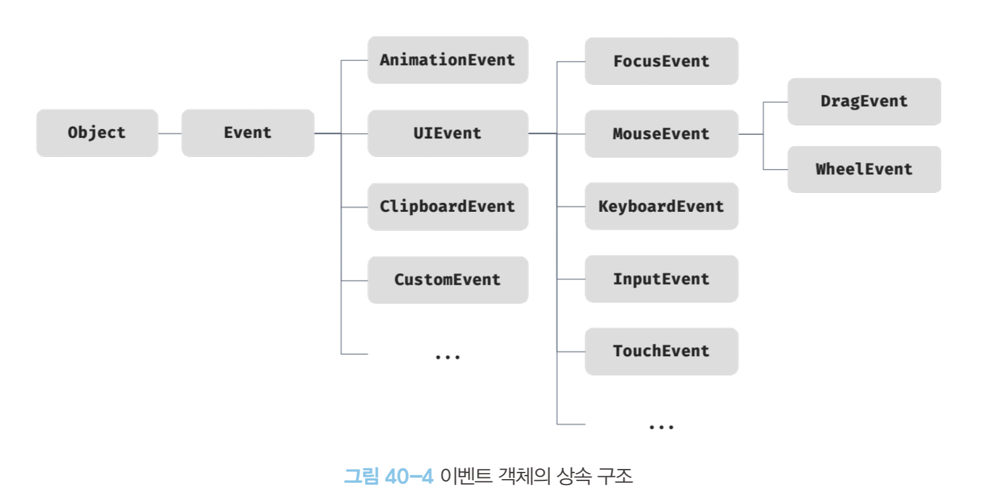
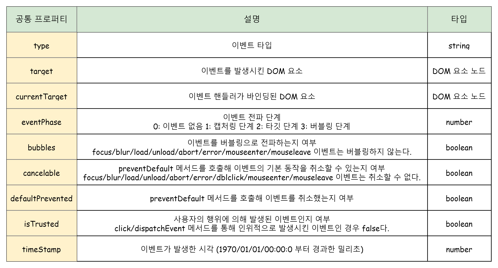
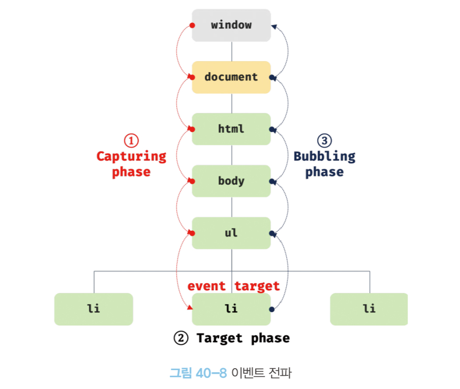

# 40장 이벤트

## 이벤트 드리븐 프로그래밍

브라우저는 사용자의 행동을 감지해 이벤트를 발생시킬 수 있으며 특정 요소에서 이벤트가 발생하면 이벤트 핸들러를 호출하도록 이벤트 핸들러 등록을 할 수 있다.

- 이벤트 핸들러: 이벤트가 발생했을 때 호출될 함수이다.
- 이벤트 핸들러 등록: 이벤트가 발생했을 때 브라우저에게 이벤트 핸들러의 호출을 위임하는 것이다.

```js
const $button = document.querySelector('button');

// 사용자가 버튼을 클릭하면 함수를 호출하도록 요청
$button.onClick = () => {
  alert('Clicked button');
};
```

이벤트와 그에 대응하는 이벤트 핸들러를 통해 사용자와 상호작용할 수 있으며 이와 같이 **프로그램 흐름을 이벤트 중심으로 제어하는 프로그래밍 방식을 이벤트 드리븐 프로그래밍**이라고 한다.

<br>

## 이벤트 핸들러 등록

이벤트 핸들러를 등록하는 방법은 3가지다.

### 이벤트 핸들러 어트리뷰트 방식

HTML 요소의 어트리뷰트 중 이벤트에 대응하는 이벤트 핸들러 어트리뷰트에 문(statement)을 할당하는 방식이다.

- 함수 호출문의 평가 결과가 이벤트 핸들러로 등록된다.
- 함수가 아닌 값을 반환하는 함수 호출문을 이벤트 핸들러로 등록하면 브라우저가 이벤트 핸들러를 호출할 수 없다.
- 이벤트 핸들러 어트리뷰트 값은 암묵적으로 생성될 이벤트 핸들러의 함수 몸체를 의미한다.

```html
<button onclick="sayHi('Han')">Button</button>
<script>
  function sayHi(name) {
    // ...
  }
</script>
```

어트리뷰트는 파싱되어 다음과 같은 함수를 암묵적으로 생성하고 이벤트 핸들러 어트리뷰트 이름과 동일한 onclick 이벤트 핸들러 프로퍼티에 할당한다.

```js
function onclick(event) {
  sayHi('Han');
}
```

### 이벤트 핸들러 프로퍼티 방식

window 객체와 Document, HTMLElement 타입의 DOM 노드 객체는 이벤트에 대응하는 이벤트 핸들러 프로퍼티를 가지고 있다.

- 이벤트 핸들러 프로퍼티의 키는 이벤트 타입이다.
- 이벤트 핸들러 프로퍼티에 함수를 바인딩하면 이벤트 핸들러가 등록된다.
- 하나의 이벤트 핸들러 프로퍼티에 하나의 이벤트 핸들러만 바인딩할 수 있다는 단점이 있다.
- 이벤트 핸들러 어트리뷰트 방식의 HTML 자바스크립트가 뒤섞이는 문제를 해결할 수 있다.

```html
<button>Button</button>
<script>
  $button = document.querySelector('button');

  $button.onclick = function () {
    // ...
  };
  /*
    $button: 이벤트 타깃
    onclick: 이벤트 타입
    function: 이벤트 핸들러
	*/
</script>
```

### addEventListener 메서드 방식

EventTarget.prototype.addEventListener는 DOM Level 2에서 도입된 이벤트를 등록할 수 있는 메서드이다.

- 이벤트 핸들러를 인수로 전달한다.
- 마지막 매개변수에 이벤트를 캐치할 이벤트 전파 단계(캡쳐링, 버블링)을 지정한다.
- 이벤트 핸들러 프로퍼티에 바인딩된 이벤트 핸들러에 영향을 주지 않는다.

```html
<button>Button</button>
<script>
  $button = document.querySelector('button');

  $button.addEventListener('click', function () {
    // ...
  });
</script>
```

<br>

## 이벤트 핸들러 제거

addEventListener로 등록된 이벤트 핸들러를 제거하려면 Event.prototype.removeEventListener 메서드를 사용해야 한다.

```js
// addEventListener에 전달한 인수와 일치하는 인수를 전달해야 한다.
const func = () => {};
$button1.addEventListener('click', func);
$button1.removeEventListener('click', func);

// 함수 자신을 가리키는 argument.callee를 사용할 수도 있다.
$button2.addEventListener('click', function () {
  // ...
  $button2.removeEventListener('click', arguments.callee);
});
```

이벤트 핸들러 프로퍼티 방식으로 등록한 이벤트 핸들러는 프로퍼티에 null을 할당해 이벤트 핸들러를 제거할 수 있다.

```js
$button.onclick = func;
$button.onclick = null;
```

<br>

## 이벤트 객체

이벤트가 발생하면 이벤트 정보를 담고 있는 이벤트 객체가 동적으로 생성된다.

- 생성된 이벤트 객체는 이벤트 핸들러의 첫 번째 인수로 전달되어 매개변수 e에 암묵적으로 할당된다.
- 핸들러 어트리뷰트 방식의 경우 이벤트 객체를 전달 받을려면 매개변수 이름이 반드시 event여야 한다.
- 이벤트 핸들러 어트리뷰트 값은 암묵적으로 생성되는 이벤트 핸들러의 첫 번째 매개변수 이름이 암묵적으로 event로 명명된다.

### 이벤트 객체의 상속구조

이벤트 객체는 다음과 같은 상속 구조를 가지며 프로토타입 체인을 구성하고 있다.



Event, UIEvent, MouseEvent 등 모두 생성자 함수이기 때문에 이를 호출해 이벤트 객체를 생성할 수 있다.

```js
let e = new Event('foo');
/*
	e instance of Event === true
	e instance of Object === true
	e.type === foo
*/

e = new FocusEvent('focus');
e = new MouseEvent('click');
// ...
```

이벤트가 발생하면 암묵적으로 생성되는 이벤트 객체도 생성자 함수에 의해 생성된다.

- 생성된 이벤트 객체는 생성자 함수와 함께 생성된 프로토타입으로 구성된 프로토타입 체인의 일원이 된다.
- 이벤트 객체 중 일부는 사용자의 행위에 의해 생성(MouseEvent)되며 일부는 자바스크립트 코드에 의해 인위적으로 생성(CustomEvent)된다.
- Event 인터페이스는 DOM 내에서 발생한 이벤트에 의해 생성되는 이벤트 객체를 나타낸다.

### 이벤트 객체의 공통 프로퍼티

Event 인터페이스 즉, Event.prototype에 정의되어 있는 이벤트 관련 프로퍼티는 모든 이벤트 객체가 상속받는 공통 프로퍼티다.



### 마우스/키보드 정보 취득

- MouseEvent 타입 이벤트 객체의 프로퍼티
  - 좌표 정보: screenX/Y, clientX/Y, pageX/Y, offsetX/Y
  - 버튼 정보: altKey, crtlKey, shfitKey, button
- KeyboardEvent 타입 이벤트 객체의 프로퍼티
  - altKey, ctrlKey, key, keyCode 등

<br>

## 이벤트 전파

DOM 트리 상에서 DOM 요소 노드에 발생한 이벤트는 DOM 트리를 통해 전파된다.

```html
<ul id="fruits">
  <li id="apple">Apple</li>
  <li id="banana">Banana</li>
  <li id="orange">Orange</li>
</ul>
```

두 번째 li 요소를 클릭하면 클릭 이벤트가 발생하며 생성된 이벤트 객체는 이벤트 타깃을 중심으로 DOM 트리를 통해 전파된다.

**이벤트 전파는 캡처링, 타깃, 버블링 총 3단계로 구분**할 수 있다.



- 캡처링 단계: 이벤트가 상위 요소에서 하위 요소 방향으로 전파
- 타깃 단계: 이벤트가 이벤트 타깃에 도달하는 단계
- 버블링 단계: 이벤트가 하위 요소에서 상위 요소 방향을 전파

### 이벤트 타깃과 커런트 타깃

다음은 ul 요소에 이벤트 핸들러를 바인딩하고 li 요소를 클릭해 이벤트를 발생시키는 예제이다.

```js
const $fruits = document.getElementyById('frutis');
const $banana = document.getElementyById('banana');

// #1. li 요소를 클릭하면 캡처링 단계의 이벤트를 캐치한다.
// addEvenetListenr 메서드에 true를 3번째 인수로 전달하면 캡처링 단계의 이벤트를 캐치할 수 있다.
$fruits.addEventListener('click', e => {
	console.log.(`이벤트 타깃: ${e.eventPhase}`); // 캡처링 단계
	console.log.(`이벤트 타깃: ${e.target}`);	// li
  console.log.(`이벤트 타깃: ${e.currentTarget}`);	// ul
}, true);

// #2. 타깃 단계의 이벤트를 캐치한다.
$banana.addEventListener('click', e => {
	console.log.(`이벤트 타깃: ${e.eventPhase}`); // 타깃 단계
	console.log.(`이벤트 타깃: ${e.target}`); // li
  console.log.(`이벤트 타깃: ${e.currentTarget}`); // li
});

// #3. 버블링 단계의 이벤트를 캐치한다.
$fruits.addEventListener('click', e => {
	console.log.(`이벤트 타깃: ${e.eventPhase}`); // 버블링 단계
	console.log.(`이벤트 타깃: ${e.target}`); // li
  console.log.(`이벤트 타깃: ${e.currentTarget}`); // ul
}, true);
```

1. 캡처링 단계
   - li 요소를 클릭하면 클릭 이벤트가 발생해 클릭 이벤트 객체가 생성되고 **li 요소가 이벤트 타깃(event.target)**이 된다. **커런트 타깃(event.currentTarget)은 ul 요소**이다.
   - 클릭 이벤트 객체는 window에서 시작해서 이벤트 타깃 방향으로 전파된다.
2. 타깃 단계
   - 이벤트 객체가 이벤트를 발생시킨 이벤트 타깃에 도달한다.
3. 버블링 단계
   - 이벤트 객체가 이벤트 타깃에서 시작해서 window 방향으로 전파된다.

위 예제와 같이 이벤트는 이벤트를 발생시킨 이벤트 타깃 뿐만 아니라 **이벤트가 통과하는 DOM 트리상의 경로에 위치한 모든 DOM 요소에서 캐치할 수 있다.**

대부분의 이벤트는 캡처링과 버블링을 통해 전파되지만 아래 이벤트들은 버블링을 통해 전파되지 않는다.

- 포커스 이벤트: focus/blur(-> focusin/focusout)
- 리소스 이벤트: load/unload/abort/error
- 마우스 이벤트: mouseenter/mouseleave(-> mouseover/mouseout)
- 이 이벤트들은 이벤트 타깃의 상위 요소에서 이벤트를 캐치하려면 캡처링 단계에서 이벤트를 캡쳐해야 하거나 괄호안의 이벤트로 대체해야 한다.

### 이벤트 핸들러가 혼용되는 경우

다음은 캡처링 단계의 이벤트와 버블링 단계의 이벤트를 캐치하는 이벤트 핸들러가 혼용되는 경우이다.

```html
<p>버블링과 캡처링 이벤트 <button>버튼</button></p>
<script>
  // 버블링 단계에서 캐치
  document.body.addEventListener('click', () => {
    console.log('Handler for body');
  });

  // 캡쳐링 단계에서 캐치
  document.querySelector('p').addEventListener(
    'click',
    () => {
      console.log('Handler for p');
    },
    true
  );

  // 타깃 단계에서 캐치
  document.querySelector('button').addEventListener('click', () => {
    console.log('Handler for button');
  });
</script>
```

만약 button 요소에서 클릭 이벤트가 발생하면 다음과 같이 출력된다

```
Handler for p
Handler for button
Handler for body
```

- 캡처링 단계의 p 요소의 이벤트 핸들러가 호출된다.
- 타깃 단계로 전파되어 이벤트가 캐치된다.
- 그 후 버블링 단계의 이벤트를 캐치하는 body 요소의 이벤트 핸들러가 호출된다.

p 요소에서 클릭 이벤트가 발생하면 다음과 같이 출력된다.

```
Handler for p
Handler for body
```

- 캡처링 단계를 캐치하는 p 요소의 이벤트 핸들러가 호출된다.
- 버블링 단계를 캐치하는 body 요소의 이벤트 핸들러가 호출된다.

<br>

## 이벤트 위임

이벤트 위임이란 여러 개의 하위 요소가 아닌 상위 DOM 요소에 이벤트 핸들러를 등록하는 방법이다.

- 여러 개의 하위 DOM 요소에 이벤트 핸들러를 등록하지 않아도 되어 성능 저하 및 유지보수 측면에서 장점이 있다.
- 동적으로 DOM 요소를 추가하더라도 추가된 DOM 요소에 이벤트 핸들러를 등록할 필요가 없다.

다음은 li에서 발생하는 이벤트 핸들링을 위해 li 요소가 아닌 li의 상위 요소 ul에 이벤트 핸들러를 등록하는 예제이다.

```html
<ul id="fruits">
  <li id="apple">Apple</li>
  <li id="banana">Banana</li>
  <li id="orange">Orange</li>
</ul>
<div>선택: <em class="msg">apple</em></div>

<script>
  const $fruits = document.getElementById('fruits');
  const $msg = document.querySelector('.msg');

  function activate({ target }) {
    // 이벤트를 발생시킨 요소가 ul(#fruits)의 자식 요소가 아니면 무시한다.
    if (!target.matches('#fruits > li')) return;

    [...$fruits].forEach(($fruit) => {
      $fruit.classList(toggle)('active', $fruit === target);
      $msg.textContent = target.id;
    });
  }

  // 이벤트 위임
  $fruit.onclick = activate;

  // 만약 이벤트 위임을 하지 않는다면?
  // document.getElementById('apple').onclick = activate;
  // document.getElementById('banana').onclick = activate;
  // document.getElementById('orange').onclick = activate;
</script>
```

이 경우 이밴트 객체의 currentTarget 프로퍼티와 target 프로퍼티는 다른 DOM 요소를 가리킨다.

<br>

## DOM 요소의 기본 동작 조작

이벤트 객체의 stopPropagation 메서드는 이벤트 전파를 중지시켜 자신에게 바인딩된 이벤트 핸들러만 실행되도록 한다.

```html
<div class="container">
  <button class="btn1">B1</button>
  <button class="btn2">B2</button>
</div>

<script>
  // 상위 요소에 이벤트 위임한다.
  // 버튼을 클릭하면 버튼 요소의 color가 red로 변경된다.
  document.querySelector('container').onclick = ({ target }) => {
    target.style.color = 'red';
  };

  // stopPropagation 메서드를 통해 이벤트 전파를 중지시켜 상위 요소에서 이벤트를 캐치할 수 없게 한다.
  // B2 버튼을 클릭하면 상위 요소로의 이벤트 전파가 중지되어 버튼 요소의 color가 red가 아닌 blue로 스타일이 변경된다.
  document.querySelector('btn2').onclick = (e) => {
    e.stopPropagation();
    e.target.style.color = 'blue';
  };
</script>
```

<br>

## 이벤트 핸들러 내부의 this

### 이벤트 핸들러 어트리뷰트 방식

- 이벤트 핸들러 어트리뷰트 값으로 지정한 문자열은 일반 함수로 호출된다. 따라서 내부의 this는 전역 객체를 가리킨다.(`#1`)
- 이벤트 핸들러를 호출할 때 인수로 전달한 this는 이벤트를 바인딩한 DOM 요소를 가리킨다.(`#2`)

```html
<button onclick="handleClick1()">B1</button>
<button onclick="handleClick2(this)">B2</button>
<script>
  function handleClick() {
    console.log(this); // #1, window
  }
  function handleClick2(button) {
    console.log(button); // #2, 이벤트를 바인딩한 button 요소
    console.log(this); // window
  }
</script>
```

### 이벤트 핸들러 프로퍼티 방식과 addEventListener 메서드 방식

- 이벤트 핸들러 내부의 this는 이벤트를 바인딩한 this 요소를 가리킨다.
- 즉, this는 이벤트 객체의 currentTarget 프로퍼티와 같다.
- 화살표 함수로 정의할 경우 이벤트 핸들러 내부의 this는 상위 스코프의 this를 가리킨다.

```html
<button class="btn1">B1</button>
<button class="btn2">B2</button>
<button class="btn3">B3</button>
<script>
  const $button1 = document.querySelector('.btn1');
   const $button2 = document.querySelector('.btn2');
   const $button3 = document.querySelector('.btn3');

   // 이벤트 핸들러 프로퍼티 방식에서의 this: 바인딩한 DOM 요소
   $button1.onclick = function(e) {
    console.log(this); // $button1
    console.log(this === e.currentTarget); // true
   }

   // addEventListener 방식에서의 this: 바인딩한 DOM 요소
   $button2.addEventListener('click', function(e) {
    console.log(this); // $button2
    console.log(this === e.currentTarget); // true
   }

   // 위 두 방식 + 화살표 함수에서의 this: 상위 스코프의 this
   $button3.addEventListener('click', (e) => {
  console.log(this); // window
  console.log(e.currentTarget); // $button3
   })
</script>
```

### 클래스에서 이벤트 핸들러를 바인딩하는 경우

- 클래스 메서드 내부의 this는 클래스가 생성할 인스턴스가 아닌 이벤트를 바인딩한 DOM 요소를 가리킨다.
- 따라서 bind 메서드를 사용해 this를 전달해 increase 메서드 내부의 this가 클래스가 생성할 인스턴스를 가리키도록 해야 한다.(`#1`)
- 메서드가 아닌 필드에 선언한 화살표 함수의 경우 내부의 this는 인스턴스를 가리킨다.(`#2`)

```js
class App {
	constructor() {
		const $button = ... ;

		// this.$button.onclick = this.increase; // X
		this.$button.onclick = this.increase.bind(this); // #1
		this.$button.onclick = this.increaseArrowFunction; // #2
	}

  // 메서드 정의
	increase() {
		// ...
	}

	// 클래스 필드에 화살표 함수 정의
	// 내부의 this는 인스턴스를 가리킨다.
	increaseArrowFunction = () => { ... }
}
```

<br>

## 이벤트 핸들러에 인수 전달

이벤트 핸들러 프로퍼티 방식과 addEventListener 메서드 방식의 경우 이벤트 핸들러를 브라우저가 호출하기 때문에 함수 자체를 등록해야 하므로 인수를 전달할 수 없다.

이 경우 다음과 같이 이벤트 핸들러 내부에서 함수를 호출하면서 인수를 전달할 수 있다.

```js
const MIN_LEN = 6;
const $input = ...;
const $msg = ...;

const checkUserNameLength = (min) => {
	$msg.textContent = $input.value.length < min ? `${min}자 이상 입력하세요.`;
}

$input.onblur = () => {
	checkUserNameLength(MIN_LEN);
}
```

<br>

## 커스템 이벤트

### 커스템 이벤트 생성

커스텀 이벤트란 개발자가 의도를 가지고 이벤트 타입을 지정하기 위해 이벤트 생성자 함수(Event, UIEvent, MouseEvent)를 호출해 생성한 이벤트 객체다.

- 이벤트 생성자 함수는 첫 번째 인수로 이벤트 타입을 나타내는 문자열을 전달받는다.
- CostumEvent 이벤트 생성자 함수의 인수에 임의의 문자열을 사용해 새로운 이벤트 타입을 지정할 수 있다.
- 생성된 커스텀 이벤트는 버블링되지 않는다. bubbles 프로퍼티 값이 false이다.
- 커스텀 이벤트는 preventDefault 메서드로 취소할 수 없다. cancelable 프로퍼티 값이 false이다.
- 커스텀 이벤트의 isTrusted 이벤트 값은 false이며 변경할 수 없다.

```js
const kbEvent = new KeyboardEvent('keyup'); // kbEvent.type === keyup

const customEvent1 = new CustomEvent('foo'); // customEvent.type === foo
console.log(customEvent1.bubbles || customEvent1.cancelable); // false

// bubbles와 cancelable 프로퍼티 값을 true로 하려면 두 번째 인수에 객체를 전달해야 한다.
const customEvent2 = new CustomEvent('bar', {
  bubbles: true,
  cancelable: true,
});

// 두 번째 인수에 객체를 전달해 객체 고유의 프로퍼티 값을 지정할 수 있다.
const customEvent3 = new MouseEvent('click', {
  bubbles: true,
  cancelable: true,
  clientX: 50,
  clientY: 100,
  isTrusted: true,
});
console.log(customEvent3.clientX); // 50
```

### 커스텀 이벤트 디스패치

이벤트 생성자 함수로 생성된 이벤트는 dispatchEvent 메서드로 디스패치 즉, 이벤트를 발생시킬 수 있다.

- 일반적인 이벤트 핸들러는 비동기 처리 방식으로 동작하지만 dispatchEvent 메서드는 동기 처리 방식으로 호출한다.
- 커스텀 이벤트에 바인딩된 이벤트 핸들러를 직접 호출하는 것과 같다.
- 커스텀 이벤트 타입의 이벤트 객체는 dispatchEvent 메서드로 디스패치하기 전에 반드시 addEventListener 메서드 방식으로 이벤트 핸들러를 등록해야 한다.

```js
const $button = document.querySelector('.btn');

// 이벤트와 함께 전달하고 싶은 정보를 detail 프로퍼티에 전달할 수 있다.
$button.addEventListner('foo', (e) => {
  alert(e.detail.message);
});

const customEvent = new CustomEvent('foo', {
  detial: { message: 'a message of custom event' },
});

// 커스텀 이벤트 디스패치
$button.dispatchEvent(customEvent);
```

---

### Summary

- 이벤트 핸들러란 이벤트가 발생했을 때 호출될 함수이며 이벤트가 발생했을 때 브라우저에게 이벤트 핸들러의 호출을 위임하는 것을 이벤트 핸들러 등록이라고 한다.
- 이벤트 핸들러는 **이벤트 핸들러 어트리뷰트 방식**, **이벤트 핸들러 프로퍼티 방식**, **addEventListener** 메서드 방식으로 등록할 수 있다.
- 이벤트가 발생하면 이벤트 정보를 담고 있는 이벤트 객체가 동적으로 동작한다.
- DOM 요소 노드에 발생한 이벤트는 DOM 트리를 통해 전파된다
  1. 캡처링 단계: 이벤트가 상위 -> 하위로 전파
  2. 타깃 단계: 이벤트가 이벤트 타깃에 도달
  3. 버블링 단계: 이벤트가 하위 -> 상위로 전파
- 커런트타깃이란 이벤트 핸들러가 바인딩된 요소이며 이벤트 타깃이란 이벤트가 발생한 요소다.
- 이벤트 위임이란 상위 DOM 요소에 이벤트 핸들러를 등록하는 방법이다.
- 이벤트 객체의 stopPropagation 메서드는 이벤트 전파를 중지시켜 자신에게 바인딩된 핸들러만 실행되도록 한다.
- 이벤트 핸들러를 등록하는 방식에 따라 내부 this의 값이 달라진다.
  - 이벤트 핸들러 어트리뷰트: 전역 객체
  - 이벤트 핸들러 프로퍼티/addEventListener: 이벤트를 바인딩한 DOM 요소
- CustomEvent 메서드를 통해 커스텀 이벤트 객체를 생성할 수 있으며 dispatchEvent 메서드를 통해 이벤트를 디스패치할 수 있다.
