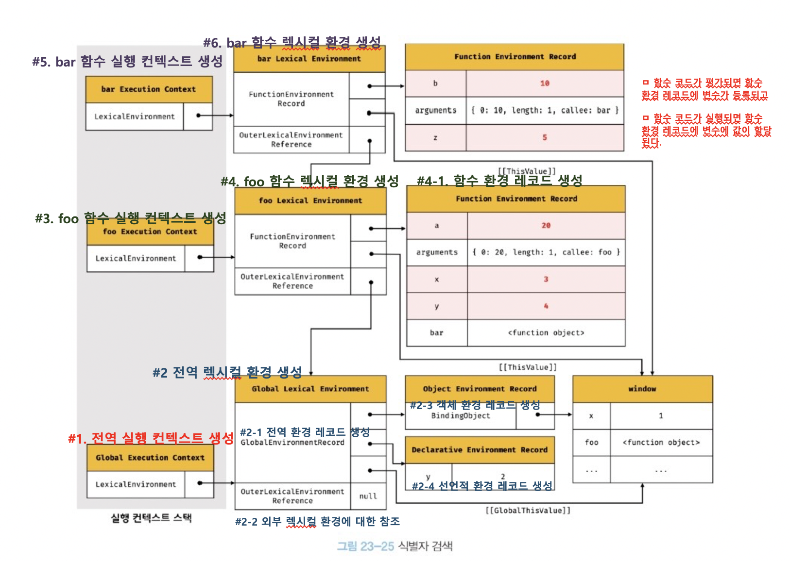

# 23장 실행 컨텍스트

**실행 컨텍스트는 소스코드를 실행하는데 필요한 환경을 제공하고 실행 결과를 관리하는 영역이다.** 실행 컨텍스트를 이해하면 식별자 바인딩, 호이스팅, 클로저, 이벤트 핸들러, 비동기 처리 등 자바스크립트의 핵심 동작 원리를 쉽게 이해할 수 있다.

<br>

## 소스코드

소스코드란 실행 가능한 코드를 의미하며 실행 컨텍스트를 생성하는 과정과 관리 내용에 따라 4가지로 분류할 수 있다. 각 코드가 평가된 후 해당되는 실행 컨텍스트가 생성된다.

### 전역 코드(→ 전역 실행 컨텍스트)

전역 실행 코드는 전역 변수를 관리하기 위해 최상위 스코프인 전역 스코프를 생성해야한다. var 키워드로 선언된 전역 변수와 함수 선언문으로 선언된 전역 함수를 전역 객체의 프로퍼티와 메서드로 바인딩하고 전역 객체와 연결되어야 한다.

### 함수 코드(→ 함수 실행 컨텍스트)

함수 코드는 지역 스코프를 생성하고 지역 스코프를 전역 스코프에서 시작하는 스코프 체인의 일부로 연결한다. 또한 지역변수와 매개변수, arguments 객체를 관리해야한다.

### eval 코드(→ eval 실행 컨텍스트)

eval 코드는 strict mode에서 자신만의 스코프를 생성한다.

### 모듈 코드(→ 모듈 실행 컨텍스트)

모듈 코드는 모듈별로 독자적인 모듈 스코프를 생성한다.

<br>

## 소스코드의 평가와 실행

자바스크립트 엔진은 소스코드를 평가하는 과정과 실행하는 과정으로 나누어 처리한다.

### 평가 과정

평가 과정에서는 실행 컨텍스트를 생성하고 변수 선언문, 함수 선언문만 먼저 실행해 생성된 변수와 함수 식별자를 실행 컨텍스트가 관리하는 스코프에 등록한다.

### 실행 과정

평가 과정이 끝나면 런타임(선언문을 제외한 소스코드의 순차적 실행)이 시작된다. 이 과정에서 변수나 함수의 참조를 실행 컨텍스트가 관리하는 스코프에서 검색해 취득한다. 변수 값의 변경, 할당 등 소스코드의 실행 결과는 다시 스코프에 등록된다.

```js
var value; // 선언문
value = 10; // 할당문
```

자바스크립트는 위 소스코드를 2개의 과정으로 나누어 처리한다.

1. 평가 과정: 선언문 `var value`를 실행해 변수 식별자 `value`를 실행 컨텍스트가 관리하는 스코프에 등록하고 `undefined`로 초기화한다.
2. 실행 과정: 평가 과정이 끝난 후 `value`가 스코프에 등록되어 있는지 확인한다. 확인이 완료되면 할당문 `value = 10`을 실행해 `value`의 값을 `10`으로 할당하고 실행 컨텍스트에 등록해 관리한다.

<br>

## 실행 컨텍스트의 역할

모든 코드는 실행 컨텍스트를 통해 실행되고 관리된다. **실행 컨텍스트는 변수, 함수, 클래스 등의 이름, 즉 식별자를 관리하고 코드 실행 순서 관리를 구현한 내부 메커니즘**이다.

아래 소스코드가 평가되고 실행되는 과정은 다음과 같다.

```js
const num1 = 100;
const num2 = 200;

function foo(n) {
  const num1 = -100;
  const num2 = -200;

  console.log(n + num1 + num2);
}

foo(100); // -200

console.log(num1 + num2); // 300
```

1. 전역 코드 평가
   - 전역 코드의 변수와 함수 선언문이 먼저 실행된다
   - 생성된 전역 변수와 전역 함수가 실행 컨텍스트가 관리하는 전역 스코프에 등록된다.
2. 전역 코드 실행
   - 전역 변수에 값이 할당되고 함수가 호출된다.
   - 함수가 호출되면 전역 코드의 실행을 중단하고 함수 내부로 코드 실행 순서를 변경한다.
3. 함수 코드 평가
   - 실행 순서 변경되어 함수 내부로 진입하면 함수 코드 평가 과정이 진행된다.
   - 매개변수와 지역 변수가 실행 컨텍스트가 관리하는 지역 스코프에 등록된다. 또한 arguments 객체가 생성되어 지역 스코프에 등록된다. this 바인딩도 결정된다.
4. 함수 코드 실행
   - 함수 코드 평가 과정 후 매개변수와 지역 변수가 할당된다
   - `console.log` 메서드 호출을 위해 `console` 객체를 스코프 체인에서 검색한다.
   - `log` 프로퍼티를 `console` 객체의 프로토타입 체인을 통해 검색한다
   - 인수로 전달된 `n + num1 + num2` 표현식이 평가되고 `n`, `num1`, `num2` 식별자를 스코프 체인에서 검색한다.
   - `console.log` 메서드가 실행되고 실행 종료 후 다시 전역 코드 실행을 계속한다.

위 과정과 같이 **소스코드가 실행되려면 스코프와 식별자, 실행 순서가 결정되고 관리되어야 한다**. 이러한 일을 하는 것이 바로 실행 컨텍스트이다.

<br>

## 실행 컨텍스트 스택

코드 실행 순서는 실행 컨텍스트 스택으로 관리된다. 코드가 실행되면 코드가 실행되는 시간 순서에 따라 실행 컨텍스트 스택에 push 되고 pop 된다.

소스코드가 평가되면 실행 컨텍스트가 생성되고 실행 컨텍스트 스택의 최상위에 쌓인다. 실행 컨텍스트의 최상위에 존재하는 실행 컨텍스트는 현재 실행중인 실행 컨텍스트이다.

```js
const num1 = 100;

function foo() {
  const num2 = 200;

  function bar() {
    const num3 = 300;
    console.log(num1 + num2 + num3);
  }
  bar();
}

foo(); // 600
```

위 소스코드를 실행 했을 때의 실행 컨텍스트 스택의 변화는 다음과 같다.

0. `bottom -> top`
1. empty
2. `전역 실행 컨텍스트`
3. `전역 실행 컨텍스트`, `foo 함수 실행 컨텍스트`
4. `전역 실행 컨텍스트`, `foo 함수 실행 컨텍스트`, `bar 함수 실행 컨텍스트`
5. `전역 실행 컨텍스트`, `foo 함수 실행 컨텍스트`
6. `전역 실행 컨텍스트`
7. empty

소스코드의 자세한 평가 및 실행 과정은 다음과 같다.

1. 전역 코드 평가 및 실행
   - 전역 코드 평가 후 전역 실행 컨텍스트를 생성하고 스택에 푸시한다.
   - 전역 변수 `num1`과 전역 함수 `foo`가 실행 컨텍스트에 등록된다.
   - 전역 코드가 실행되어 전역 변수에 값이 할당되고 전역 함수가 실행된다.
2. `foo` 함수 코드 평가 및 실행
   - 전역 함수인 `foo`가 실행되면 전역 코드에서 함수 내부로 코드 실행 순서가 변경된다.
   - `foo` 함수 내부의 코드를 평가하고 `foo` 함수 실행 컨텍스트를 생성한 다음 스택에 푸시한다.
   - `num2`와 `bar` 함수가 `foo` 함수 실행 컨텍스트에 등록된다.
   - `foo` 함수 코드가 실행되어 `num2`에 값이 할당되며 중첩 함수 `bar`가 호출된다.
3. bar 함수 코드의 평가 및 실행
   - 코드 제어권이 `bar` 함수 내부로 변경된다.
   - `bar` 함수 내부의 코드를 평가하고 `bar` 함수 실행 컨텍스트를 생성한 다음 스택에 푸시한다.
   - 함수 내부의 지역 변수가 `bar` 함수의 실행 컨텍스트에 등록된다.
   - `bar` 함수가 실행되어 값이 할당되고 `console.log` 메서드 호출 후 `bar` 함수가 종료된다.
4. `foo` 함수로 복귀
   - `bar` 함수 실행 컨텍스트를 스택에서 pop
   - 더이상 실행할 코드가 없으므로 `foo` 함수가 종료된다.
5. 전역 코드로 복귀
   - `foo` 함수 실행 컨텍스트를 스택에서 pop
   - 전역에 더이상 실행할 코드가 없으므로 전역 실행 컨텍스트 pop

<br>

## 렉시컬 환경

**렉시컬 환경은 식별자, 식별자에 바인딩된 값, 상위 스코프에 대한 참조를 기록하는 자료 구조이며 실행 컨텍스트를 구성하는 컴포넌트**다. 즉, 스코프를 구분해 식별자를 등록하고 관리하는 저장소의 역할을 하는 렉시컬 스코프의 실체다.

실행 컨텍스트는 LexicalEnvironment 컴포넌트와 VariableEnvironment 컴포넌트로 구성된다. 이 두 컴포넌트는 렉시컬 환경을 참조한다.

렉시컬 환경은 다음과 같은 두 개의 컴포넌트로 구성된다

- 환경 레코드(environment record): 스코프에 포함된 식별자를 관리하고 식별자에 바인딩된 값을 관리한다.
- 외부 렉시컬 환경에 대한 참조(outer lexical environment reference): 해당 실행 컨텍스트를 생성한 소스코드를 포함하는 상위 코드의 렉시컬 환경을 참조한다.

```
실행 컨텍스트
	> 렉시컬 환경
		 > 환경 레코드: 스코프 역할
				> 객체 환경 레코드: var 전역 변수, 전역 함수
				> 선언적 환경 레코드: let, const 전역 변수
		 > 외부 환경에 대한 참조: 스코프 체인
```

<br>

## 실행 컨텍스트의 생성과 식별자 검색 과정

```js
var x = 1; // #1
const y = 2;

function foo(a) {
  // #2
  var x = 3;
  const y = 4;

  function bar(b) {
    const z = 5;
    console.log(a + b + x + y + z);
  }
  bar(10);
}

foo(20); // 42
```

위 소스코드가 실행되면 다음과 같은 순서로 실행 컨텍스트가 생성되고 식별자를 검색한다.

### 전역 객체 생성

빌트인 표준 객체 및 프로퍼티, 호스트 객체 등의 전역 객체는 전역 코드 평가 전에 생성된다. 전역 객체는 `Object.prototype`을 상속받는다.

### 전역 코드 평가

소스코드가 로드되면 엔진은 전역 코드를 평가한다. 세부적인 과정은 다음과 같다.

1. 전역 실행 컨텍스트 생성(`#1`)
   - 전역 실행 컨텍스트를 생성해 실행 컨텍스트 스택에 푸시한다.
2. 전역 렉시컬 환경 생성(`#2`)
   - 전역 렉시컬 환경(환경 레코드, 외부 렉시컬 환경에 대한 참조로 구성)을 생성하고 전역 실행 컨텍스트에 바인딩한다.
     - 전역 환경 레코드 생성
       - 전역 환경 레코드는 전역 스코프 역할을 하며 전역 객체의 프로퍼티, 함수, 표준 빌트인 객체를 제공한다.
       - 전역 환경 레코드는 객체 환경 레코드와 선언적 환경 레코드로 구성된다.
         - 객체 환경 레코드 생성: var 전역 변수와 함수 선언문 전역 함수는 객체 환경 레코드의 BindingObject를 통해 전역 객체의 메서드가 된다. 변수는 `undefined`로 할당된다.
         - 선언적 환경 레코드 생성: let, const 전역 변수는 전역 변수의 프로퍼티가 아닌 선언적 환경 레코드에 등록되고 관리된다.
   - 전역 환경 레코드의 `[[GlobalThisValue]]` 내부 슬롯에 this(전역 객체)가 바인딩 된다.
   - 외부 렉시컬 환경에 대한 참조를 결정한다.
3. 전역 코드 실행
   - 전역 코드가 순차적으로 실행되며 변수 `x`, `y`에 값이 할당되고 `foo` 함수가 호출된다.
   - 할당 및 호출을 위해 식별자 결정을 해야하며 이를 위해 실행 컨텍스트에서 해당 식별자를 검색한다.
   - 스코프 체인을 따라 검색하며 전역 실행 컨텍스트의 렉시컬 환경에서도 식별자를 찾지 못하면 `Reference Error`가 발생한다.
4. `foo` 함수 코드 평가(`#3, #4`)
   - 함수 실행 컨텍스트를 생성하고 함수 렉시컬 환경을 생성한다.
5. `foo` 함수 코드 실행
   - 매개변수에 인수가 할당되고 지역 변수 `x`, `y`에 값이 할당된다.
   - 함수 `bar`가 호출된다.
6. `bar` 함수 코드 평가(`#5, #6`)
   - 함수 실행 컨텍스트를 생성하고 함수 렉시컬 환경을 생성한다.
7. `bar` 함수 코드 실행
   - 매개변수에 인수가 할당되고 지역 변수 `z`에 값이 할당된다.
   - `console` 식별자를 실행 컨텍스트의 렉시컬 환경에서 검색한다. 찾을 수 없으므로 스코프 체인에 따라 `foo` 함수의 렉시컬 환경으로 이동한다.
   - 찾을 수 없으므로 전역 렉시컬 환경으로 이동해 전역 렉시컬 환경의 객체 환경 레코드의 BindingObject를 통해 찾는다.
   - `console` 객체에서 `log` 메서드를 검색한다.
   - 표현식 `a+b+x+y+z`를 평가하기 위해 각 식별자들을 렉시컬 환경에서 검색한다.
   - `console.log` 메서드를 호출한다.
8. `bar` 함수 코드 실행 종료
   - `bar` 함수 실행 컨텍스트가 스택에서 pop 된다.
9. `foo` 함수 코드 실행 종료
   - `foo` 함수 실행 컨텍스트가 스택에서 pop 된다.
10. 전역 코드 실행 종료
    - 전역 실행 컨텍스트가 pop 되어 실행 컨텍스트 스택이 빈 상태가 된다.

**글로 보면 개떡같으니 7번까지 과정을 그림으로 확인해보자.**



<br>

## Summary

- 실행 컨텍스트는 소스코드를 실행하기 위한 환경을 제공하고 코드 실행 순서와 식별자를 관리하는 영역이다.
- 실행 컨텍스트를 생성하는 과정과 관리하는 내용에 따라 전역/함수/eval/모듈 코드로 분류 할 수 있으며 각 코드는 해당하는 실행 컨텍스트를 생성한다.
- 소스코드 평가 과정에서는 실행 컨텍스트를 생성하고 선언문을 실행해 변수와 함수 식별자를 실행 컨텍스트의 스코프에 등록한다
- 소스코드 실행 과정에서는 할당문을 실행해 스코프에 등록된 변수에 값을 할당하고 함수를 호출한다.
- 코드 실행 순서는 실행 컨텍스트의 스택으로 관리된다. 코드가 실행되면 코드가 실행되는 시간 순서에 따라 실행 컨텍스트 스택에 push 되고 pop 된다.
- 렉시컬 환경은 식별자, 식별자 바인딩, 상위 스코프에 대한 참조를 기록하는 자료 구조이자 렉시컬 스코프의 실체다
- 전역 코드가 평가 되는 과정은 다음과 같다.
  1. 전역 실행 컨텍스트 생성
  2. 전역 렉시컬 환경 생성
     2.1 전역 환경 레코드 생성
     2.1.1 객체 환경 레코드 생성
     2.1.2 선언적 환경 레코드 생성
     2.2 this 바인딩
     2.3 외부 렉시컬 환경에 대한 참조 결정
- 함수 코드가 평가되는 과정은 다음과 같다.
  1. 함수 실행 컨텍스트 생성
  2. 함수 렉시컬 환경 생성
     2.1 함수 환경 레코드 생성
     2.2 this 바인딩
     2.3 외부 렉시컬 환경에 대한 참조 결정
- 전역 객체를 가르키는 식별자없이 어떻게 전역 객체의 프로퍼티에 접근할 수 있는 이유
  - 실행 컨텍스트의 렉시컬 환경이 참조하는 전역 렉시컬 환경의 전역 환경 레코드의 BindingObject 프로퍼티가 전역 객체를 참조하고 있기 떄문이다.
