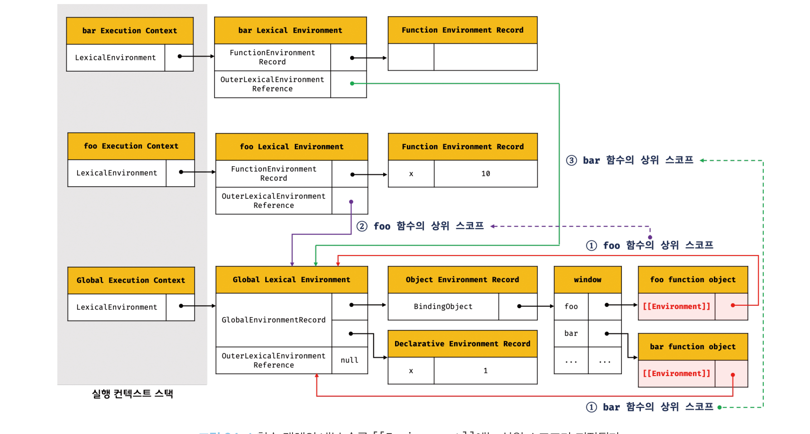
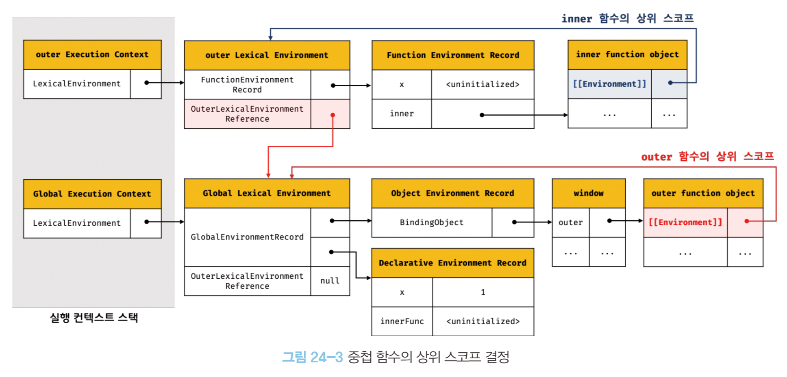
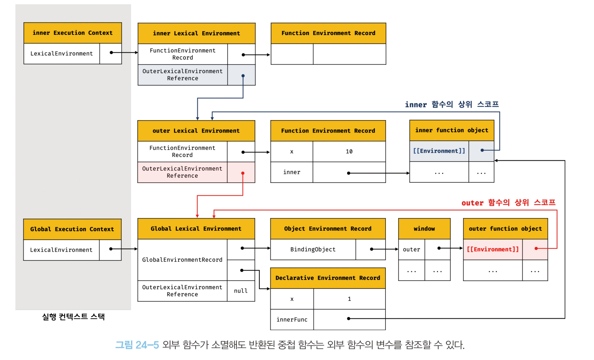

# 24장 클로저

MDN에서는 클로저를 다음과 같이 정의하고 있다.

> 클로저는 함수와 그 함수가 선언된 렉시컬 환경과의 조합이다.

실행 컨텍스트의 렉시컬 환경은 스코프의 실체다. 렉시컬 환경은 자신의 `외부 렉시컬 환경에 대한 참조`를 통해 상위 렉시컬 환경과 연결된다. 함수의 상위 스코프를 결정한다는 것은 렉시컬 환경의 `외부 렉시컬 환경에 대한 참조`에 저장할 참조값을 결정한다는 것과 같다.

<br>

## 렉시컬 스코프

**자바스크립트 엔진은 함수를 어디서 호출했는지가 아니라 어디에 정의했는지에 따라 상위 스코프를 결정한다.** 함수의 상위 스코프는 함수를 정의한 위치에 의해 정적으로 결정되고 변하지 않는다.

```js
const x = 1;

function foo() {
  const x = 100;

  function baz() {
    console.log(x);
  }

  bar();
  baz();
}

function bar() {
  console.log(x);
}

foo(); // ?
```

위 코드에서 `foo`와 `bar` 함수는 전역에서 정의된 전역 함수이며 `baz`는 `foo` 함수 내부에서 선언된 지역 함수이다. 함수는 정의한 위치에 따라 상위 스코프가 결정되므로 `foo` 함수와 `bar` 함수의 상위 스코프는 전역 스코프가 되며 `baz` 함수의 상위 스코프는 `foo` 함수 스코프가 되어 콘솔에 `1`, `100`이 출력된다.

**렉시컬 환경의 `외부 렉시컬 환경에 대한 참조`에 저장할 참조값 즉, 상위 스코프에 대한 참조는 함수 정의가 평가되는 시점에 함수가 정의된 환경(위치)에 의해 결정된다. 이것이 바로 렉시컬 스코프다.**

<br>

## 함수 객체의 내부 슬롯 [[Environment]]

함수는 `[[Environment]]` 내부 슬롯에 자신이 정의된 환경 즉, 상위 스코프의 참조를 저장한다. `[[Environment]]`에 저장된 상위 스코프의 참조는 현재 실행중인 실행 컨텍스트의 렉시컬 환경을 가리킨다.

함수 객체는 자신이 존재하는 한 `[[Environment]]` 내부 슬롯에 저장한 상위 스코프를 기억한다.

```js
const x = 1;

function foo() {
  const x = 100;

  bar();
}

function bar() {
  console.log(x);
}

foo();
bar();
```

위 코드에서 `foo`와 `bar` 함수는 전역에서 정의된 전역 함수이므로 전역 코드가 평가되는 시점에 함수 객체를 생성하고 전역 객체의 메서드가 된다. 이때 생성된 함수 객체의 내부 슬롯 `[[Enviornment]]`에는 전역 코드 평가 시점에 실행 중인 렉시컬 환경인 전역 렉시컬 환경의 참조가 된다.



함수 코드가 평가 될 때 함수 렉시컬 환경의 `외부 렉시컬 환경에 대한 참조`에는 함수 객체의 `[[Environment]]`에 저장된 렉시컬 환경의 참조가 할당된다.(그림에서 2,3)

위 그림과 같은 과정으로 함수 정의 위치에 따라 상위 스코프를 결정한다.

<br>

## 클로저와 렉시컬 환경

**외부 함수보다 중첩 함수가 더 오래 유지되는 경우 중첩 함수는 이미 생명 주기가 종료한 외부 함수의 변수를 참조할 수 있다**. 이 경우 중첩 함수를 클로저라고 한다.

```js
const x = 1;

function outer() {
  const x = 10;
  const inner = function () {
    console.log(x);
  };

  return inner;
}

const innerFunc = outer();
innerFunc(); // 10
```

위 코드를 실행하면 콘솔에 `10`이 출력된다. 자세한 실행 과정은 다음과 같다.

1. `outer` 함수가 평가 되어 함수 객체를 생성할 때 전역 렉시컬 환경을 `outer` 함수 객체의 `[[Environment]]` 내부 슬롯에 상위 스코프로서 저장한다.
2. `outer` 함수를 호출하면 `outer` 함수의 렉시컬 환경이 생성되고 `outer` 함수 객체의 `[[Environment]]` 내부 슬롯에 저장된 전역 렉시컬 환경을 `outer` 함수 렉시컬 환경의 `외부 렉시컬 환경에 대한 참조`에 할당한다.
3. 런타임에 평가되는 중첩 함수 `inner` 함수가 평가 될 때 자신의 `[[Environment]]` 내부 슬롯에 `outer` 함수의 렉시컬 환경을 상위 스코프로 저장한다.
   
4. `outer` 함수의 실행이 종료되면 `inner` 함수를 반환하며 `outer` 함수의 생명 주기가 종료되고 outer 함수의 실행 컨텍스트가 스택에서 제거된다.
5. `outer` 함수의 렉시컬 환경은 `inner` 함수의 `[[Environment]]` 내부 슬롯에 의해 참조되고 있고 `inner` 함수는 `innerFunc`에 의해 참조되고 있으므로 가비지 컬렉션에 대상이 되지 않는다. 따라서 `outer` 함수의 렉시컬 환경은 소멸되지 않는다.
   
6. `outer` 함수가 반환한 `inner` 함수를 호출하면 `inner` 함수 실행 컨텍스트가 생성되고 스택에 푸시되고 렉시컬 환경의 외부 렉시컬 환경에 대한 참조에는 `inner` 함수 객체의 `[[Environment]]` 내부 슬롯에 저장되어 있는 참조값이 할당된다.

중첩 함수 `inner`는 외부 함수 `outer` 보다 오래 생존해 외부 함수의 생존 여부와 상관 없이 상위 스코프의 식별자를 참조할 수 있고 식별자를 변경할 수 있다.

<br>

## 클로저의 활용

클로저는 의도치않게 상태가 변경되지 않도록 상태를 안전하게 은닉하고 유지하며 특정 함수에게만 상태 변경을 허용하기 위해 사용된다.

```js
const character = function () {
  let level = 1;

  return {
    currentLevel() {
      return level;
    },
    levelUp() {
      return ++level;
    },
  };
};

const c1 = character();
const c2 = character();

console.log(c1.levelUp()); // 2
console.log(c1.currentLevel()); // 2

console.log(c2.levelUp()); // 2
console.log(c2.levelUp()); // 3
console.log(c2.currentLevel()); // 3
```

```js
// 고차 함수

// 레벨을 유지하기 위해 자유 변수 level을 기억하는 클로저를 반환한다.
const character = (function () {
  let level = 1;

  return function (predicate) {
    level = predicate(level);
    return level;
  };
})();

function levelUp(level) {
  return ++level;
}

function currentLevel(level) {
  return level;
}

console.log(character(currentLevel)); // 1
console.log(character(levelUp)); // 2
console.log(character(currentLevel)); // 2
```

<br>

## 캡슐화와 정보 은닉

대부분의 객체지향 언어들은 `public`, `private`, `protected`와 같은 접근 제한자를 통해 객체의 상태가 변경되는 것을 방지해 정보를 보호하고 객체 간의 결합도를 낮추는 정보 은닉이 가능하다. 그러나 자바스크립트는 접근 제한자를 제공하지 않기 때문에 기본적으로 객체의 모든 프로퍼티와 메서드가 public하다.

> 2021년 1월, TC39 프로세스의 stage 3에서 클래스에 private 필드를 정의 할 수 있는 표준 사양이 제안되었으며 현재 최신 브라우저 및 Node.js에 구현되어 있다.(25장에서 나올 예정)

> TC39 프로세스란 ECMA-262 사양에 새로운 표준 사양을 추가하기위해 명문화 해놓은 1~5 스테이지의 과정을 말한다.

```js
// #1
function Person(name, age) {
  this.name = name; // public
  let _age = age; // private

  this.introduce = function () {
    console.log(`My name is ${this.name}. I am ${_age}`);
  };
}

const p1 = new Person('Daniel', 20);
const p2 = new Person('Paul', 40);

p1.introduce(); // My name is Daniel. I am 20
console.log(p1.name, p1._age); // Daniel, undfiend

p2.introduce(); // My name is Paul. I am 40
console.log(p2.name, p2._age); // Paul, undefined
```

```js
// #2. 프로토타입

const Person = (function () {
  let _age = 0;

  function Person(name, age) {
    this.name = name; // public;
    _age = age;
  }

  Person.prototype.introduce = function () {
    console.log(`My name is ${this.name}. I am ${_age}`);
  };

  return Person;
})();

const p1 = new Person('Daniel', 20);
const p2 = new Person('Paul', 40);

// Daniel의 age를 20으로 지정했지만 introduce 메서드는 동일한 상위 스코프를 사용하기 떄문에 40으로 출력된다.
p1.introduce(); // My name is Daniel. I am 40
console.log(p1.name, p1._age); // Daniel, undfiend

p2.introduce(); // My name is Paul. I am 40
console.log(p2.name, p2._age); // Paul, undefined
```

위 코드와 같이 구현할 수 있지만 `#1`의 경우 `introduce` 메서드가 중복 생성되고, `#2`처럼 프로토타입으로 구현할 경우 private한 변수의 상태가 유지되지 않아 완벽하게 private한 프로퍼티를 구현할 수 없다.

<br>

## 자주 발생하는 실수

```js
var funcs = [];

for (var i = 0; i < 3; i++) {
  funcs[i] = function () {
    return i;
  };
}

for (var j = 0; j < funcs.length; j++) {
  console.log(funcs[j]());
}

// ?
```

위 예제를 실행하면 콘솔에 `0`, `1`, `2`가 아닌 `3`이 세 번 출력된다. `var` 키워드로 선언된 변수인 `i`는 함수 레벨 스코프이기 때문에 전역 변수처럼 동작하며 두 번째 `for` 문에서 호출될 때의 전역 변수 `i`는 값이 3이기 때문이다.

위와 같은 코드를 다음과 같이 수정해 의도한대로 동작하게 할 수 있다.

### 클로저 사용하기

```js
var funcs = [];

for (var i = 0; i < 3; i++) {
  funcs[i] = (function (id) {
    return function () {
      return id;
    };
  })(i);
}

for (var j = 0; j < funcs.length; j++) {
  console.log(funcs[j]());
}
```

### let, const 키워드 사용하기

`let`이나 `const` 키워드를 사용하는 반복문은 코드 블록을 반복 실행할 때 마다 새로운 렉시컬 환경을 생성해 반복할 당시의 상태를 스냅샷처럼 저장한다.

```js
let funcs = [];

for (let i = 0; i < 3; i++) {
  funcs[i] = function () {
    return i;
  };
}

for (let j = 0; j < funcs.length; j++) {
  console.log(funcs[j]());
}
```

### 고차 함수

```js
const funcs = Array.from(new Array(3), (_, i) => i);

funcs.forEach((f) => console.log(f()));
```

<br>

## Summary

- 렉시컬 환경은 자신의 `렉시컬 환경에 대한 참조`를 통해 상위 렉시컬 환경과 연결된다.
- 상위 스코프에 대한 참조는 함수 정의가 평가되는 시점에 함수가 정의된 환경(위치)에 의해 결정된다. 이것이 렉시컬 스코프이다.
- 함수 객체는 `[[Environment]]` 내부 슬롯에 상위 스코프에 대한 참조를 저장한다.
- 외부 함수보다 중첩 함수가 더 오래 유지되는 경우 중첩 함수는 이미 생명 주기가 종료한 외부 함수(상위 스코프)의 변수(식별자)를 참조할 수 있다. 이때 중첩 함수를 클로저라고 한다.
- 클로저를 통해 의도치않게 상태가 변경되지 않게 상태를 은닉하고 유지할 수 있다.
- `let`이나 `const` 키워드를 사용하는 반복문은 코드 블록을 반복 실행할 때 마다 새로운 렉시컬 환경을 생성해 반복할 당시의 상태를 스냅샷처럼 저장한다.
