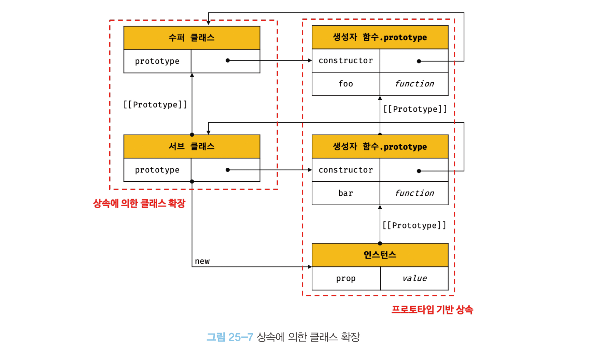

# 25장 클래스

ES6에서 도입된 클래스는 클래스 기반 객체지향 프로그래밍과 흡사한 객체 생성 메커니즘이다. 자바스크립트에서의 클래스는 함수이며 프로토타입 기반 패턴을 클래스 기반 패턴처럼 사용하게 해준다.

<br>

## 클래스는 프로토타입의 문법적 설탕인가?

ES6의 클래스가 기본 프로토타입 기반 객체지향 모델을 폐지하고 새로운 클래스 기반의 객체지향 모델을 제공하는 것은 아니다. 기존 프로토타입 기반 패턴을 클래스 기반 패턴처럼 사용할 수 있도록 해주는 문법적 설탕이라고도 볼 수 있다.

클래스와 생성자 함수 모두 프로토타입 기반의 인스턴스를 생성하며 매우 유사하게 동작하지만 다음과 같은 차이가 있다.

- 클래스는 `new` 연산자없이 호출하면 에러가 발생하지만 생성자 함수는 일반 함수로서 호출된다.
- 클래스는 상속을 지원하는 `extends`와 `super` 키워드를 지원한다.
- 클래스는 호이스팅이 발생하지 않는 것처럼 동작하지만 함수 선언문으로 정의된 생성자 함수는 함수 호이스팅이, 함수 표현식으로 정의된 생성자 함수는 변수 호이스팅이 발생한다.
- 클래스 내부는 암묵적으로 strict mode가 지정된다.
- 클래스의 constructor, 프로토타입 메서드, 정적 메서드 모두 `[[Enumerable]]`의 값이 `false`이다.

클래스를 프로토타입 기반의 생성 패턴의 문법적 설탕보다 **새로운 객체 생성 메커니즘**이라고 보는 것이 더 합당하다.

<br>

## 클래스 정의

클래스는 `class` 키워드를 사용해 다음과 같은 방식으로 정의할 수 있다.

```js
// 선언문
class Class1 {}

// 익명 클래스 표현식
const Class2 = class {};

// 기명 클래스 표현식
const Class3 = class MyClass {};
```

<br>

## 클래스 호이스팅

클래스는 함수 선언문과 같이 소스코드 평가과정에 함수로 평가되며 생성된 함수 객체는 생성자 함수로 호출할 수 있는 함수다. 함수 정의가 평가되어 함수 객체가 생성되는 시점에 프로토타입이 생성된다.

클래스는 클래스 정의 이전에 참조하면 `ReferenceError`가 발생하며 `let`, `const` 변수처럼 호이스팅이 발생하지 않는 것처럼 동작한다.

<br>

## 인스턴스 생성과 메서드

클래스는 생성자 함수이며 반드시 `new` 연산자와 함께 호출해야 한다. 클래스 표현식에 사용한 클래스 이름은 외부 코드에서 접근이 불가능하다.

```js
class Car {}

const car = Car(); // TypeError

const Motorcycle = class Mt {};
const m1 = new Motorcycle(); // Ok
const m2 = new MT(); // ReferenceError
```

클래스 내부에서 정의할 수 있는 메서드는 constructor, 프로토타입 메서드, 정적 메서드 세 가지가 있다.

- constructor: 인스턴스를 생성하고 초기화하며 내부의 `this`는 클래스가 생성한 인스턴스를 가리킨다. 클래스 당 하나만 존재하며 내부에 명시적인 반환문을 작성해서는 안된다.
- 프로토타입 메서드: 생성자 함수에서와 다르게 클래스의 `prototype` 프로퍼티에 메서드를 추가하지 않아도 프로토타입 메서드가 된다.
- 정적 메서드: 인스턴스를 생성하지 않아도 호출할 수 있는 메서드 즉, 클래스에 바인딩된 메서드이다. 인스턴스로 상속받을 수 없다.

```js
class Car {
  // 생성자
  constructor(color) {
    this.color = color;
  }

  // 프로토타입 메서드
  printColor() {
    console.log(`color: ${this.color}`);
  }

  // 정적 메서드
  static sound() {
    console.log('Vroom Vroom ~');
  }
}

const car = new Car('Red');
car.printColor(); // color: red
Car.sound(); // Vroom Vroom ~
```

<br>

## 인스턴스 생성 과정

클래스의 인스턴스 생성 과정은 다음과 같다.

1. 인스턴스 생성과 this 바인딩
   - `new` 연산자와 함께 클래스를 호출하면 암묵적으로 인스턴스가 빈 객체로 생성되고 프로토타입으로 클래스의 `prototype` 프로퍼티가 가르키는 객체가 설정된다.
   - 인스턴스가 this에 바인딩된다.
2. 인스턴스 초기화
   - constructor 내부 코드가 실행되어 this에 바인딩되어 있는 인스턴스를 초기화한다.
3. 인스턴스 반환
   - 모든 처리가 끝나면 인스턴스가 바인딩된 this에 암묵적으로 반환된다.

```js
class Car {
  constructor(color) {
    // 1. 인스턴스 생성, this 바인딩
    console.log(this); // Car {}
    console.log(Object.getPrototypeOf(this) === Car.prototype); // true

    // 2. 인스턴스 초기화
    this.color = color;

    // 3. 인스턴스 반환
  }
}
```

<br>

## 프로퍼티

### 인스턴스 프로퍼티

constructor 내부에서 this에 추가한 프로퍼티는 언제나 클래스가 생성한 인스턴스의 프로퍼티가 된다.

### 접근자 프로퍼티

접근자 프로퍼티는 다른 데이터 프로퍼티에 값을 읽는 `getter` 함수. 저장할 때 사용하는 `setter` 함수로 구성되어 있다. `getter`, `setter`는 접근자 함수로 구성되어 있지만 호출할 때는 프로퍼티처럼 참조해야 한다.

```js
class Car {
  constructor(model, worth) {
    this.model = model;
    this.worth = worth;
  }

  get info() {
    return `${this.model}, $ ${this.worth}.`;
  }

  set price(cost) {
    this.worth = cost;
  }
}

const myCar = new Car('Model X', 140000000);
console.log(myCar.info); // Model X, $ 140000000.

myCar.price = 100000000;
console.log(myCar.info); // Model X, $ 100000000.
```

### 클래스 필드 정의 제안과 private, static

자바스크립트의 클래스 몸체에는 메서드만 선언할 수 있다.

```js
class Car {
  model = 'Camry';

  // 클래스 필드에 함수를 할당하면 프로토타입 메서드가 아닌 인스턴스 메서드가 된다.
  getModel = function () {
    return this.model;
  };
}

const car = new Car();
console.log(car, car.getModel());
// Car {}, Camry
```

일반적인 클래스 필드 정의 제안에서의 클래스 필드는 public하다. 이 경우 private 필드 정의를 통해 해결할 수 있다. private 필드는 클래스 내부에서만 참조할 수 있다. 또한 static 키워드를 통해 static 필드를 정의할 수 있다.

```js
class Car {
  #model = '';

  constructor(model) {
    this.#model = model;
  }

  static vehicleCategory = 'car';

  static #privateStatic = 'It is a private and static field.';
}

console.log(Car.vehicleCategory); // car

const car = new Car('Camry');
// private 필드는 클래스 내부에서만 참조할 수 있다.
console.log(Car.#privateStatic);
console.log(car.#model);
// Uncaught SyntaxError: Private field '#model' must be declared in an enclosing class
```

위 내용 모두 정식 사양은 아니며 2021년 1월, TC39의 stage 3에 제안되었다.현재 최신 브라우저와 최신 Node.js 버전에서는 정의가 가능하다.

<br>

## 상속에 의한 클래스 확장



프로토타입 기반의 상속은 프로토타입을 통해 다른 객체의 자산을 상속받는 개념이지만 **상속에 의한 클래스의 확장은 클래스를 상속받아 새로운 클래스를 확장하는 개념이다.**

상속에 의한 클래스의 확장은 코드 재사용 관점에서 매우 유용하다.

### extends 키워드와 동적 상속

extends 키워드를 통해 상속받을 클래스를 정의할 수 있다. 클래스 뿐만 아니라 생성자 함수도 상속받을 수 있다. 단, 피상속 대상은 클래스여야 한다.

```js
class Vehicle {
  // ...
}

class Car extends Vehicle {
  //  ...
}
```

```js
// 클래스 동적 상속

function Base1() {}

class Base2 {}

let condition = true;

class Derived extends (condition ? Base1 : Base2) {}

const d = new Derived();

console.log(d instanceof Base1); // true
console.log(d instanceof Base2); // false
```

extends 키워드를 통해 수퍼클래스와 서브클래스 간의 상속 관계를 설정할 수 있으며 인스턴스의 프로토타입 프로토타입 체인과 클래스간의 프로토타입 체인을 생성해 프로토타입 메서드, 정적 메서드 모두 상속이 가능하다.

### 서브클래스의 constructor, super

클래스에서 constructor를 생략하면 비어있는 constructor가 암묵적으로 생성된다.

super 키워드를 함수처럼 호출하면 수퍼클래스의 constructor를 호출하며 식별자 처럼 참조하면 수퍼클래스의 메서드를 호출할 수 있다. super 키워드는 다음과 같은 특징을 갖는다.

- 서브클래스에서 constructor를 생략하지 않는 경우 서브클래스의 constructor에서 super를 반드시 호출해야한다.
- 서브클래스의 constructor에서 super를 호출하기 전에는 this를 참조할 수 없다.

```js
class Base {
  constructor(a, b) {
    this.a = a;
    this.b = b;
  }

  sound() {
    return 'Vroom';
  }
}

class Sub extends Base {
  // 암묵적 constructor 정의
  // constructor(...args) { super(...args) }

  sound() {
    return super.sound();
  }
}

const s = new Sub(1, 2);
console.log(s); // Sub {a:1, b:2}
console.log(s.sound()); // Vroom
```

ES6의 메서드 축약 표현으로 정의된 함수는 `[[HomeObject]]`를 갖는다. 이 내부 슬롯은 자신을 바인딩하고 있는 객체를 가리키며 이 내부 슬롯을 가지는 함수만이 super 참조를 할 수 있다.

### 상속 클래스의 인스턴스 생성 과정

상속 관계에 있는 클래스의 인스턴스 생성 과정은 다음과 같다.

1. 서브클래스의 super 호출
   - 자바스크립트 엔진은 `[[ConstuctorKind]]` 내부 슬롯을 통해 수퍼와 서브 클래스를 구분한다.
   - new 연산자와 함께 호출되면 암묵적으로 빈 객체의 인스턴스를 생성하고 this에 바인딩한다.
   - 서브클래스는 수퍼클래스에게 인스턴스 생성을 위임한다. 서브클래스의 constructor에서 super를 호출해야하는 이유가 바로 이것 때문이다.
2. 수퍼클래스의 인스턴스 생성과 this 바인딩
   - 수퍼클래스의 constructor 내부 코드가 실행되기 전 빈 s객체의 인스턴스를 생성한다.
   - 수퍼클래스의 constructor 내부의 `new.target`은 서브클래스를 가리킨다.
   - 따라서 생성된 인스턴스의 프로토타입은 수퍼클래스가 아닌 서브클래스의 프로토타입이다.
3. 수퍼클래스의 인스턴스 초기화
4. 서브클래스 constructor로의 복귀오 this 바인딩
   - suepr의 호출이 종료되면 super가 반환한 인스턴스가 this에 바인딩된다.
   - 서브클래스의 constructor 내부의 인스턴스는 suepr 호출 후 처리되어야 한다.
5. 서브클래스의 인스턴스 초기화
   - super 호출 이후 constructor에 기술되어 있는 인스턴스 초기화가 진행된다.
6. 인스턴스 반환
   - 클래스의 모든 처리가 끝나면 완성된 인스턴스가 바인딩된 this가 암묵적으로 반환된다.

### 표준 빌트인 생성자 함수 확장

표준 빌트인 생성자 함수 또한 `[[Constructor]]` 내부 메서드를 갖는 생성자 함수이므로 extends 키워드를 통한 상속이 가능하다.

```js
class MyArray extends Array {
  average() {
    return this.reduce((acc, cur) => acc + cur, 0) / this.length;
  }
}

const a = new MyArray(1, 2, 3);

console.log(a.average()); // 2
```

<br>

## Summary

- ES6에서 도입된 클래스는 프로토타입 기반 패턴을 클래스 기반 패턴처럼 사용하게 해주는 객체 생성 메커니즘이다.
- 클래스는 new 연산자와 함께 호출해야한다.
- 클래스는 호이스팅이 발생하지 않는 것처럼 동작하지만 실제로는 호이스팅이 발생한다.
- 인스턴스는 인스턴스 생성 & this 바인딩 -> 인스턴스 초기화 -> 인스턴스 반환 단계로 생성된다.
- 프로퍼티에는 인스턴스 프로퍼티(cosntructor), 접근자 프로퍼티(getter, setter)가 있다.
- 클래스 몸체에는 메서드만 선언할 수 있지만 모던 브라우저와 node.js에서는 필드 정의 및 private, static 키워드 사용이 가능하다.
- 클래스는 상속에 의한 확장이 가능하며 extends 키워드를 통해 상속받을 클래스나 생성자 함수를 정의할 수 있다. 또한 동적 상속과 빌트인 생성자 함수 상속이 가능하다.
- 서브클래스의 constructor 내부에는 반드시 super를 호출해야 한다.
