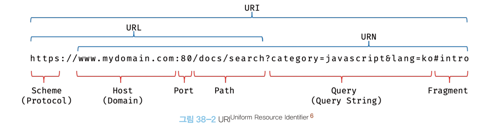

# 38장 브라우저의 렌더링 과정

대부분의 프로그래밍 언어는 운영체제나 가상 머신 위에서 실행되지만 자바스크립트는 브라우저에서 HTML, CSS와 함께 실행된다.

따라서 브라우저가 HTML, CSS, 자바스크립트로 작성된 문서를 어떻게 파싱하여 브라우저에 렌더링하는 하는지 알아야 한다.

- 파싱: 텍스트 문서의 문자열을 토큰으로 분해하고 토큰의 문법적 의미와 구조를 반영해 파스 트리를 생성하는 일련의 과정이다.
- 렌더링: HTML, CSS, 자바스크립트로 작성된 문서를 파싱해 브라우저에 시각적으로 출력하는 것이다.

브라우저의 렌더링 수행 과정은 다음과 같다.

1. 렌더링에 필요한 리소스를 요청하고 서버로부터 응답 받는다.
2. 브라우저의 렌더링 엔진은 서버로부터 응답된 HTML, CSS를 파싱해 DOM과 CSSOM을 생성하고 결합해 렌더 트리를 생성한다.
3. 브라우저의 자바스크립트 엔진은 응답된 자바스크립트를 생성해 추상구문트리를 생성하고 바이트코드로 변환해 실행한다.
   - 이 과정에서 자바스크립트는 DOM API를 통해 DOM이나 CSSOM(CSS Object Model)을 변경할 수 있다.
   - 변경된 DOM과 CSSOM은 다시 렌더 트리로 결합된다.
4. 렌더 트리를 기반으로 HTML 요소의 레이아웃을 계산하고 브라우저 화면에 HTML 요소를 페인팅한다.

<br>

## 요청과 응답

브라우저의 핵심 기능은 서버에 존재하는 리소스들을 요청하고 서버가 응답한 리소스를 파싱해 렌더링하는 것이다.

브라우저의 주소창에 URL을 입력하고 엔터 키를 누르면 URL의 호스트 이름이 DNS를 통해 IP 주소로 변환되고 해당 서버에 요청을 전송한다.



> URI, URL, URN의 차이([출처](https://hanamon.kr/%EB%84%A4%ED%8A%B8%EC%9B%8C%ED%81%AC-%EA%B8%B0%EB%B3%B8-url-uri-urn-%EC%B0%A8%EC%9D%B4%EC%A0%90/))
>
> - URI(Uniform Resource Identifier): 인터넷에 있는 리소스를 나타내는 유일한 주소다.
> - URL(Uniform Resource Locator): 웹 페이지, 이미지, 동영상 등의 파일이 위치한 정보를 나타낸다.
> - URN(Uniform Resource Name): 이름으로 리소스를 특정하는 URI다.
> - URL은 어떻게 리소스를 얻을 것이고 어디에서 가져와야하는지 명시하는 URI이다.
> - URN은 리소스를 어떻게 접근할 것인지 명시하지 않고 경로와 리소스 자체를 특정하는 것을 목표로하는 URI이다.

<br>

## HTTP 1.1과 HTTP 2.0

HTTP는 웹에서 브라우저와 서버가 통신하기 위한 프로토콜이다.

### HTTP 1.1

- 기본적으로 커넥션 당 하나의 요청과 응답만 처리한다.
- HTML 문서 내에 포함된 link, img, script 태그 등에 의한 리소스 요청과 응답이 개별적으로 전송된다.
- 리소스의 동시 전송이 불가하므로 리소스 개수에 비례해 응답시간이 늘어난다.

### HTTP 2.0

- 커넥션 당 여러 개의 요청과 응답이 가능하다.
- HTTP 1.1과 비교해 페이지 로드 속도가 50% 정도 빠르다.

<br>

## HTML 파싱과 DOM 생성

순수한 텍스트인 HTML 문서를 시각적으로 렌더링하려면 HTML 문서를 브라우저가 이해할 수 있는 자료구조로 변환해 메모리에 저장해야 한다.

브라우저의 렌더링 엔진은 HTML 문서를 파싱해 브라우저가 이해할 수 있는 자료 구조인 DOM을 생성한다.

간략한 DOM 생성 과정은 다음과 같다.(39장에 자세히 나옴)

1. HTML 파일이 브라우저 요청에 의해 응답된다.
2. 브라우저는 서버가 응답한 HTML 문서를 바이트 형태로 응답 받는다.
3. 문자열로 변환된 HTML 문서를 토큰들로 분해한다.
4. 토큰들을 객체로 변환해 노드를 생성한다.
5. HTML 문서는 HTML 요소들의 집합으로 이루어지며 중첩 관계를 반영한 트리 자료구조인 DOM을 생성한다.

DOM은 HTML 문서를 파싱한 결과물이다.

<br>

## CSS 파싱과 CSSOM 생성

렌더링 엔진은 HTML을 처음부터 한줄씩 파싱하면서 DOM을 생성하다 CSS를 로드하는 태그를 만나면 DOM 생성을 중단하고 CSSOM을 생성한다.

과정은 다음과 같다.

1. CSS 태그의 어트리뷰트에 지정된 파일(`<link href="여기">`)를 서버에 요청한다.
2. 로드된 CSS 파일과 코드를 HTML 동일하게 파싱한다.
   - 바이트 -> 문자 -> 토큰 -> 노드 -> CSSOM
3. CSSOM이 생성되고 파싱이 완료되면 HTML 파싱이 중단된 지점으로 돌아간다.
4. HTML 파싱을 재개한다.

CSSOM은 CSS를 파싱해 구조화한 트리 구조이다.

<br>

## 렌더 트리 생성

렌더링 엔진은 렌더링을 위해 DOM과 CSSOM을 렌더 트리로 결합한다.

- 렌더 트리는 렌더링을 위한 트리 구조의 자료구조다.
- 브라우저 화면에 렌더링되지 않는 노드(meta/script 태그, display:none)들은 렌더 트리에 포함되지 않는다.

완성된 렌더 트리는 HTML 요소의 레이아웃을 계산하는데 사용되며 브라우저 화면에 픽셀을 렌더링하는 페인팅 처리에 입력된다.

```
HTML -> DOM tree ┐
                 ├> Render tree -> Layout -> Paint
CSS -> CSSOM tree┘
```

다음과 같은 경우 레이아웃 계산과 페인팅이 재차 실행된다.

- 자바스크립트에 의해 노드가 추가되거나 삭제될 때
- 브라우저 창의 뷰포트 크기 변경
- HTML 요소의 위치, 크기를 변경시키는 스타일의 변경

<br>

## 자바스크립트 파싱과 실행

렌더링 엔진은 HTML을 한 줄씩 파싱하다 script 태그를 만나면 DOM 생성을 중단하고 제어권을 자바스크립트 엔진으로 넘긴다.

자바스크립트 엔진은 자바스크립트 파싱과 실행을 처리하며 CPU가 이해할 수 있는 저수준언어로 변환해 실행한다.

실행 과정은 다음과 같다.

1. 토크나이징(토크나이저)
   - 자바스크립트 소스코드를 어휘 분석해 토큰으로 분해한다.
2. 파싱(파서)
   - 토큰들의 집합을 구문 분석해 AST를 생성한다.
   - AST는 토큰에 문법적 의미와 구조를 반영한 트리다.
   - AST를 통해 TS, Babel과 같은 트랜스파일러를 구현할 수 있다.
3. 바이트코드 생성(바이트코드 생성기)
   - AST를 인터프리터가 실행할 수 있는 중간 코드인 바이트코드로 변환한다.
4. 실행(인터프리터)
   - 인터프리터에 의해 실행된다.

<br>

## 리플로우와 리페인트

DOM API를 의해 DOM이나 CSSOM이 변경되면 리플로우 리페인트가 실행된다. 단, 레이아웃 변경이 없는 경우 리페인트만 실행된다.

- 리플로우: 레이아웃 계산을 다시 수행한다.
- 리페인트: 재결합된 렌더 트리를 기반으로 다시 페인트한다.

<br>

## 자바스크립트 파싱에 의한 HTML 파싱 중단

**왜 script 태그를 body 태그 가장 아래에 위치시켜야 할까?**

- 브라우저는 동기적 즉, 위에서 아래 방향으로 순차적으로 HTML, CSS, 자바스크립트를 파싱하고 실행한다.
- 자바스크립트 코드에서 DOM API를 사용하기 전 DOM과 CSSOM이 미리 생성되어 있지 않으면 문제가 발생할 수 있다.
- 따라서 body 태그 가장 아래에 script 태그를 위치시켜 DOM 생성을 완료한 이후에 자바스크립트를 실행시켜야 한다.

<br>

## script 태그의 async/defer 어트리뷰트

async와 defer는 sciprt 태그에 의한 블락킹을 해결하기 위해 HTML5에 추가된 어트리뷰트이다.

src 어트리뷰트로 자바스크립트를 로드하는 경우 사용할 수 있다.

### async

- HTML 파싱과 외부 자바스크립트 파일의 로드가 비동기적으로 동시에 진행된다.
- 자바스크립트 파싱과 실행은 파일의 로드가 완료된 직후 진행되며 이떄 HTML 파싱은 중단된다.
- 여러개의 async 어트리뷰트가 있으면 script 태그 순서 상관없이 로드된다.

### defer

- HTML 파싱과 외부 자바스크립트 파일의 로드가 비동기적으로 동시에 진행된다.
- 자바스크립트 파싱과 실행이 HTML 파싱이 완료 즉, DOM 생성이 완료된 직후에 발생한다.

<br>

---

### !Summary 작성해야함
