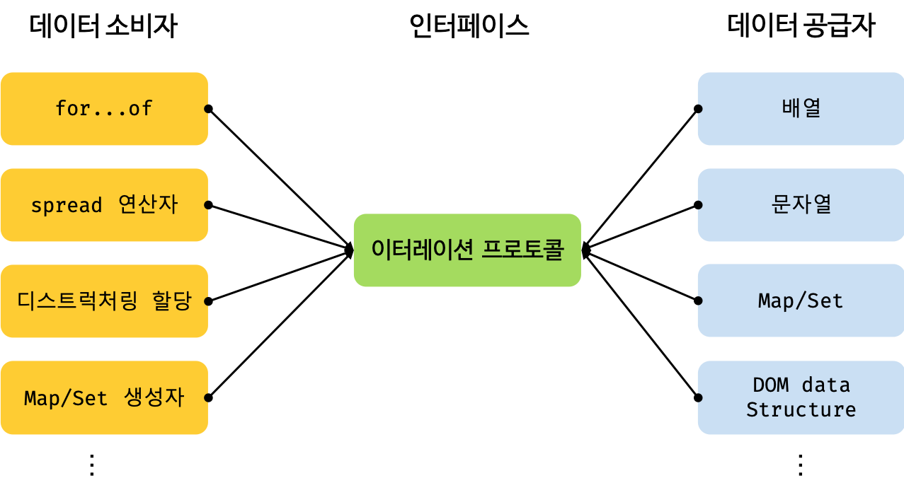

# 34장 - 이터러블
- ES6에서는 순회 가능한 데이터 컬렉션을 이터레이션 프로토콜을 준수하는 이터러블로 통일하여 for...of문, 스프레드 문법, 배열 디스트럭처링 할당의 대상으로 사용할 수 있도록 일원화했다
- 데이터 소비자와 데이터 공급자를 연결하는 인터페이스 역할


## 이터레이션 프로토콜
- 이터레이션 프로토콜은 순회 가능한 자료구조를 위한 규칙
- 이터레이션 프로토콜을 준수하는 컬렉션은 for...of 문, 스프레드 문법, 배열 디스트럭처링 할당의 대상이 될 수 있다.
- 이터레이션 프로토콜에는 `이터러블 프로토콜`과 `이터레이터 프로토콜`이 있다.
  - 이터러블 프로토콜(iterable protocol)
    - Well-known Symbol인 Symbol.iterator를 키로 사용한 메서드를 직접 구현하거나 Symbol.iterator 메서드를 호출하면 이터레이터 프로토콜을 준수한 이터레이터를 반환한다.
    - 이러한 규약을 이터러블 프로토콜이라 하며, 이터러블 프로토콜을 준수한 객체를 이터러블이라 한다.
    - 이터러블은 for...of 문으로 순회할 수 있으며 스프레드 문법과 배열 디스트럭처링 할당의 대상으로 사용할 수 있다
  - 이터레이터 프로토콜(iterator protocol)
    - 이터러블의 Symbol.iterator 메서드를 호출하면 이터레이터 프로토콜을 준수한 이터레이터를 반환한다.
    - 이터레이터는 next 메서드를 소유하며 next 메서드를 호출하면 이터러블을 순회하며 value와 done 프로퍼티를 갖는 이터레이터 리절트 객체를 반환한다.
    - 이터레이터 프로토콜을 준수한 객체를 이터레이터라 한다.


### 이터러블
- 이터러블 프로토콜을 준수한 객체를 `이터러블`이라고한다.
- 이터러블은 for ...of 문으로 순회할 수 있으며, 스프레드 문법, 배열 디스트럭처링 할당의 대상이된다.
- Array와 String은 자바스크립트의 빌트인 이터러블이다.

```js
const array = [1, 2, 3];
console.log(Symbol.iterator in array); // true
for(const item of array){
  console.log(item);
}
console.log([...array]);

const iterator = array[Symbol.iterator]();
console.log(iterator.next()); //{ value: 1, done: false};
console.log(iterator.next()); //{ value: 2, done: false};
console.log(iterator.next()); //{ value: 3, done: false};
console.log(iterator.next()); //{ value: undefined, done: true};
```

## for...of 문
- for ...of 문은 이터러블을 순회하기 위한 문법이다.
    ```js
    for (변수 선언문 of 이터러블) { ... }
    ```
- for ...of 문은 내부적으로 이터러블의 Symbol.iterator를 통해 이터레이터를 얻는다.
- 이터레이터의 next 메서드를 통해 순회하는데 next가 반환하는 리절트 객체의 value 프로퍼티를 for...of 문 변수에 할당한다.
